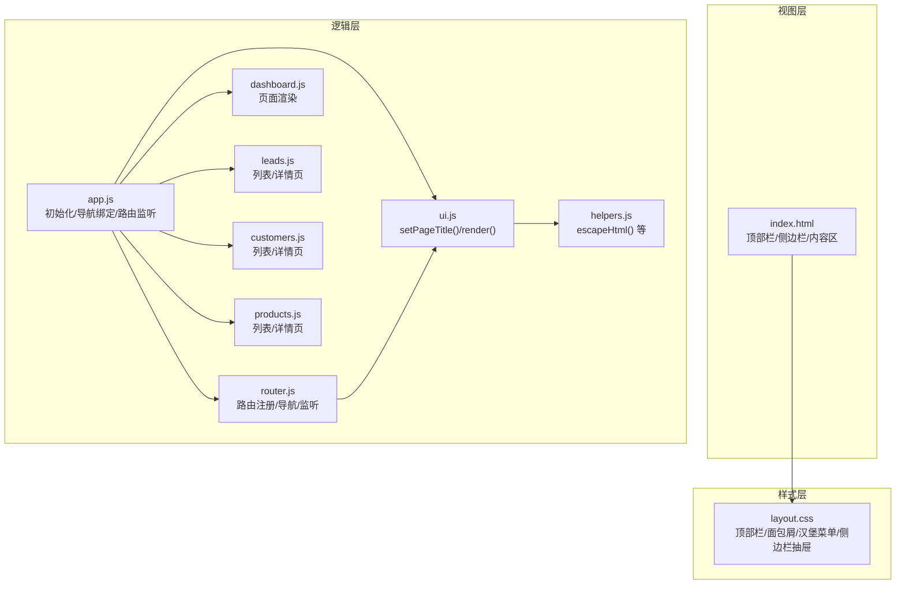
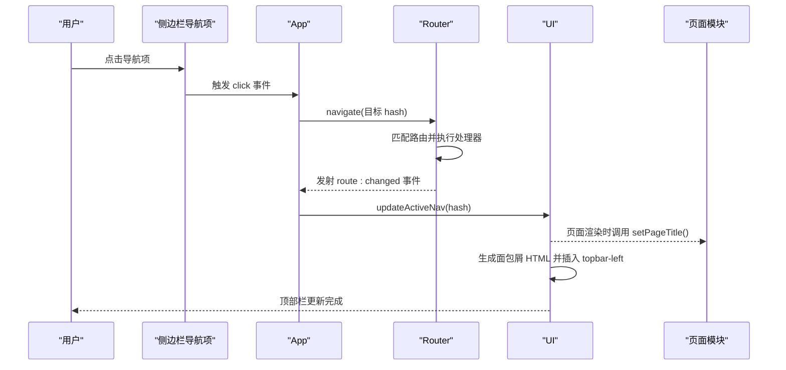
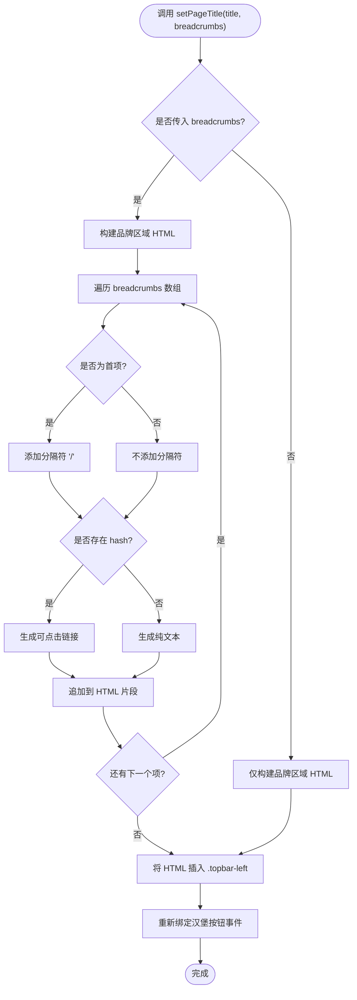
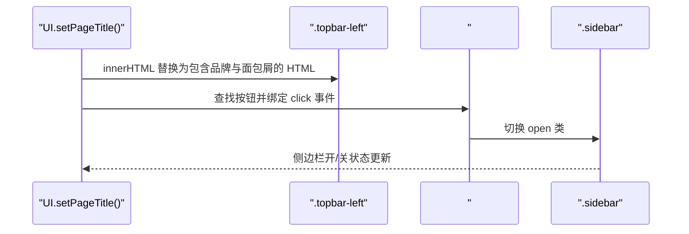
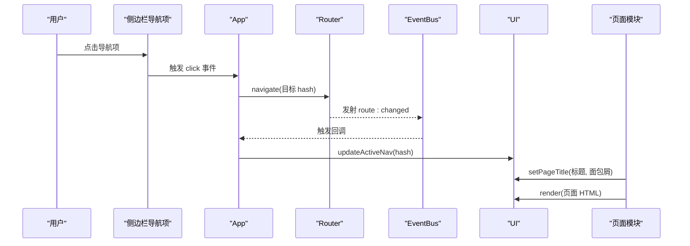
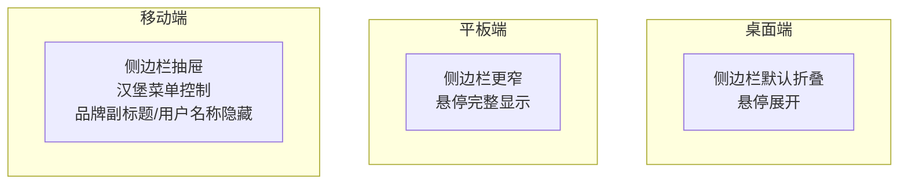
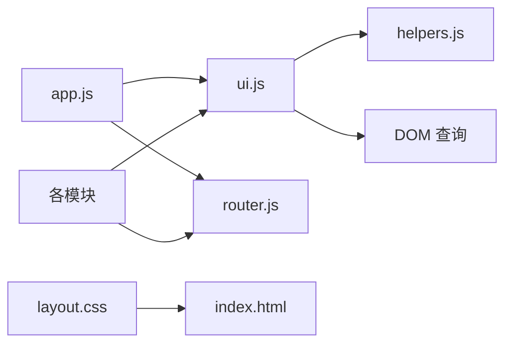

# 页面导航系统

<cite>
**本文引用的文件列表**
- [index.html](file://index.html)
- [layout.css](file://css/layout.css)
- [ui.js](file://js/ui.js)
- [router.js](file://js/router.js)
- [helpers.js](file://js/utils/helpers.js)
- [app.js](file://js/app.js)
- [dashboard.js](file://js/modules/dashboard.js)
- [leads.js](file://js/modules/leads.js)
- [customers.js](file://js/modules/customers.js)
- [products.js](file://js/modules/products.js)
</cite>

## 目录
1. [简介](#简介)
2. [项目结构](#项目结构)
3. [核心组件](#核心组件)
4. [架构总览](#架构总览)
5. [详细组件分析](#详细组件分析)
6. [依赖关系分析](#依赖关系分析)
7. [性能考量](#性能考量)
8. [故障排查指南](#故障排查指南)
9. [结论](#结论)
10. [附录](#附录)

## 简介
本文件系统性地解析 CRM 系统的页面导航子系统，重点围绕 UI.setPageTitle() 方法展开，阐述页面标题设置与面包屑导航的生成机制；解释顶部栏动态内容更新与汉堡菜单按钮事件绑定；提供导航系统的 API 文档、HTML 转义处理策略；并通过多个页面的实际配置示例说明简单标题与复杂面包屑结构的使用方式；最后总结响应式设计与移动端适配要点。

## 项目结构
导航系统由以下层次构成：
- 视图层：index.html 提供顶部栏、侧边栏与内容区的基础结构
- 样式层：layout.css 定义顶部栏、面包屑、汉堡菜单、侧边栏抽屉等响应式样式
- 逻辑层：ui.js 提供 setPagetitle()、render() 等 UI 工具；router.js 提供路由注册与导航；helpers.js 提供 HTML 转义等工具；app.js 负责应用初始化、导航绑定与路由监听；各模块（如 dashboard.js、leads.js、customers.js、products.js）负责页面渲染与面包屑配置

图表来源
- [index.html:14-139](file://index.html#L14-L139)
- [layout.css:14-123](file://css/layout.css#L14-L123)
- [ui.js:318-371](file://js/ui.js#L318-L371)
- [router.js:4-61](file://js/router.js#L4-L61)
- [helpers.js:78-84](file://js/utils/helpers.js#L78-L84)
- [app.js:43-61](file://js/app.js#L43-L61)
- [dashboard.js:6-209](file://js/modules/dashboard.js#L6-L209)
- [leads.js:21-157](file://js/modules/leads.js#L21-L157)
- [customers.js:23-182](file://js/modules/customers.js#L23-L182)
- [products.js:22-124](file://js/modules/products.js#L22-L124)

章节来源
- [index.html:14-139](file://index.html#L14-L139)
- [layout.css:14-123](file://css/layout.css#L14-L123)

## 核心组件
- UI.setPageTitle(title, breadcrumbs?)
  - 功能：更新顶部栏左侧区域，保留品牌区，动态插入面包屑导航；同时重新绑定汉堡菜单按钮事件
  - 参数：
    - title: 字符串，页面主标题
    - breadcrumbs: 可选数组，每个元素包含 label 与可选 hash 的对象，用于生成面包屑链接
  - 处理：调用 Helpers.escapeHtml() 对文本进行安全转义；对 hash 存在的项生成可点击链接，否则作为纯文本展示
- UI.render(html)
  - 功能：将页面内容渲染到 #app-content 容器
- Router.register(pattern, handler)
  - 功能：注册路由模式与处理器，支持路径参数捕获
- Router.navigate(hash)
  - 功能：编程式导航至指定 hash
- Helpers.escapeHtml(str)
  - 功能：对字符串进行 HTML 转义，防止 XSS 攻击
- App.init() 中的导航绑定
  - 功能：为侧边栏导航项绑定点击事件，点击后通过 Router.navigate() 跳转，并在移动端关闭侧边栏

章节来源
- [ui.js:318-371](file://js/ui.js#L318-L371)
- [router.js:8-46](file://js/router.js#L8-L46)
- [helpers.js:78-84](file://js/utils/helpers.js#L78-L84)
- [app.js:43-61](file://js/app.js#L43-L61)

## 架构总览
导航系统采用“视图-样式-逻辑”三层分离：
- 视图层：index.html 定义顶部栏、侧边栏与内容区结构
- 样式层：layout.css 控制顶部栏布局、面包屑样式、汉堡菜单显示与侧边栏抽屉行为
- 逻辑层：ui.js 提供页面标题与面包屑更新；router.js 提供路由注册与导航；app.js 负责初始化与事件绑定；各业务模块在渲染时调用 UI.setPageTitle() 并传入面包屑配置

图表来源
- [app.js:43-61](file://js/app.js#L43-L61)
- [router.js:22-36](file://js/router.js#L22-L36)
- [ui.js:318-371](file://js/ui.js#L318-L371)

## 详细组件分析

### UI.setPageTitle() 实现与面包屑生成
- 结构组成
  - 保持品牌区域不变：始终包含汉堡按钮、品牌图标、品牌文字与副标题
  - 面包屑区域：当传入 breadcrumbs 时，按顺序生成分隔符“/”，对每个项进行转义处理；若存在 hash，则生成可点击链接，否则作为纯文本
  - 重新绑定事件：每次更新后重新查找并绑定汉堡菜单按钮的点击事件，确保事件不会重复绑定
- HTML 转义策略
  - 对面包屑 label 使用 Helpers.escapeHtml()，避免用户输入导致的 XSS
  - 对链接 hash 本身不进行转义（hash 由系统内部生成），但对显示文本进行转义
- 面包屑层级与链接处理
  - 层级：从左到右依次为“首页/模块/当前项”等
  - 链接：仅对带有 hash 的项生成链接；无 hash 的项仅显示文本，不生成链接
  - 交互：点击链接会触发 Router.navigate()，从而更新页面内容与高亮状态

图表来源
- [ui.js:318-356](file://js/ui.js#L318-L356)
- [helpers.js:78-84](file://js/utils/helpers.js#L78-L84)

章节来源
- [ui.js:318-356](file://js/ui.js#L318-L356)
- [helpers.js:78-84](file://js/utils/helpers.js#L78-L84)

### 顶部栏动态内容更新与汉堡菜单事件绑定
- 动态更新
  - 通过 UI.setPageTitle() 将面包屑与品牌区域拼接后的 HTML 插入 .topbar-left
  - 顶部栏右侧的搜索、通知、用户信息等保持原样
- 汉堡菜单按钮
  - 按钮 ID 为 #btn-sidebar-toggle，点击后切换 .sidebar 的 open 类，实现移动端侧边栏抽屉效果
  - UI.setPageTitle() 每次都会重新绑定该按钮事件，避免重复绑定导致的多次切换问题

图表来源
- [ui.js:318-356](file://js/ui.js#L318-L356)
- [index.html:18-46](file://index.html#L18-L46)
- [layout.css:422-481](file://css/layout.css#L422-L481)

章节来源
- [ui.js:318-356](file://js/ui.js#L318-L356)
- [index.html:18-46](file://index.html#L18-L46)
- [layout.css:422-481](file://css/layout.css#L422-L481)

### 路由与导航联动
- 路由注册
  - 各模块在 init() 中通过 Router.register() 注册页面路由，如 '#/leads'、'#/leads/view/:id'
- 导航触发
  - App.init() 中为侧边栏导航项绑定 click 事件，点击后 Router.navigate() 跳转
  - 路由变化时，App 监听 EventBus 的 'route:changed' 事件，调用 UI.updateActiveNav() 更新侧边栏高亮
- 页面渲染
  - 每个模块在 render() 中调用 UI.setPageTitle() 设置标题与面包屑，然后通过 UI.render() 将内容插入 #app-content

图表来源
- [app.js:35-41](file://js/app.js#L35-L41)
- [router.js:22-36](file://js/router.js#L22-L36)
- [ui.js:318-371](file://js/ui.js#L318-L371)

章节来源
- [app.js:35-41](file://js/app.js#L35-L41)
- [router.js:22-36](file://js/router.js#L22-L36)
- [ui.js:318-371](file://js/ui.js#L318-L371)

### API 文档

- UI.setPageTitle(title, breadcrumbs?)
  - 参数
    - title: 字符串，页面主标题
    - breadcrumbs?: 可选数组，元素形如 { label: string, hash?: string }。label 会被转义；hash 用于生成链接
  - 返回：无
  - 注意：面包屑项的 hash 不参与转义；label 会通过 Helpers.escapeHtml() 转义
- UI.render(html)
  - 参数：字符串或 HTMLElement
  - 功能：将内容渲染到 #app-content
- Router.register(pattern, handler)
  - 功能：注册路由模式与处理器，支持路径参数捕获
- Router.navigate(hash)
  - 功能：编程式导航至指定 hash
- Helpers.escapeHtml(str)
  - 功能：HTML 转义，防止 XSS

章节来源
- [ui.js:318-371](file://js/ui.js#L318-L371)
- [router.js:8-46](file://js/router.js#L8-L46)
- [helpers.js:78-84](file://js/utils/helpers.js#L78-L84)

### 面包屑配置示例

- 简单页面标题（无面包屑）
  - 示例：Dashboard.render() 中直接调用 UI.setPageTitle('数据看板')
  - 效果：仅显示品牌区域与页面标题，无面包屑
  - 参考：[dashboard.js:6-7](file://js/modules/dashboard.js#L6-L7)

- 复杂面包屑结构（多层级）
  - 示例：Leads.renderDetail(id) 中调用 UI.setPageTitle(item.name, [{ label: '线索管理', hash: '#/leads' }, { label: item.name }])
  - 效果：生成“线索管理/当前线索名称”的可点击面包屑链路
  - 参考：[leads.js:88-92](file://js/modules/leads.js#L88-L92)
- 客户详情页
  - 示例：Customers.renderDetail(id) 中调用 UI.setPageTitle(item.name, [{ label: '客户管理', hash: '#/customers' }, { label: item.name }])
  - 效果：生成“客户管理/当前客户名称”的面包屑
  - 参考：[customers.js:94-98](file://js/modules/customers.js#L94-L98)
- 产品详情页
  - 示例：Products.renderDetail(id) 中调用 UI.setPageTitle(item.name, [{ label: '产品管理', hash: '#/products' }, { label: item.name }])
  - 效果：生成“产品管理/当前产品名称”的面包屑
  - 参考：[products.js:77-84](file://js/modules/products.js#L77-L84)

章节来源
- [dashboard.js:6-7](file://js/modules/dashboard.js#L6-L7)
- [leads.js:88-92](file://js/modules/leads.js#L88-L92)
- [customers.js:94-98](file://js/modules/customers.js#L94-L98)
- [products.js:77-84](file://js/modules/products.js#L77-L84)

### 响应式设计与移动端适配
- 汉堡菜单
  - 在大屏（>1024px）：侧边栏默认折叠，悬停展开
  - 在中屏（≤1024px）：侧边栏进一步收窄，仅显示图标，悬停恢复完整菜单
  - 在小屏（≤768px）：侧边栏变为固定抽屉，通过 #btn-sidebar-toggle 控制开关；品牌副标题隐藏；搜索框宽度缩小；用户名称隐藏
- 面包屑与品牌区域
  - 在小屏下，品牌副标题与用户名称会隐藏以节省空间
  - 面包屑在小屏下仍保持可见，便于用户识别当前位置

图表来源
- [layout.css:432-481](file://css/layout.css#L432-L481)

章节来源
- [layout.css:432-481](file://css/layout.css#L432-L481)

## 依赖关系分析
- UI.setPageTitle() 依赖
  - Helpers.escapeHtml()：对面包屑 label 进行转义
  - DOM 查询：.topbar-left、#btn-sidebar-toggle、.sidebar
- 路由与导航
  - App.init() 依赖 Router.navigate() 与 EventBus.on('route:changed')
  - 各模块依赖 Router.register() 与 Router.current() 判断当前路由
- 样式依赖
  - 顶部栏、面包屑、汉堡菜单、侧边栏抽屉样式由 layout.css 提供

图表来源
- [ui.js:318-371](file://js/ui.js#L318-L371)
- [helpers.js:78-84](file://js/utils/helpers.js#L78-L84)
- [app.js:35-41](file://js/app.js#L35-L41)
- [router.js:4-61](file://js/router.js#L4-L61)
- [index.html:14-139](file://index.html#L14-L139)
- [layout.css:14-123](file://css/layout.css#L14-L123)

章节来源
- [ui.js:318-371](file://js/ui.js#L318-L371)
- [helpers.js:78-84](file://js/utils/helpers.js#L78-L84)
- [app.js:35-41](file://js/app.js#L35-L41)
- [router.js:4-61](file://js/router.js#L4-L61)
- [index.html:14-139](file://index.html#L14-L139)
- [layout.css:14-123](file://css/layout.css#L14-L123)

## 性能考量
- 面包屑生成
  - 仅在页面渲染时生成一次 HTML，避免频繁 DOM 操作
  - 对每个面包屑项进行转义，确保安全但不影响性能
- 事件绑定
  - UI.setPageTitle() 每次都会重新绑定汉堡按钮事件，避免重复绑定导致的内存泄漏
- 路由监听
  - 通过 EventBus.on('route:changed') 更新侧边栏高亮，避免轮询，降低 CPU 开销

## 故障排查指南
- 面包屑不显示
  - 检查是否正确传入 breadcrumbs 数组，且每项包含 label；hash 可选
  - 确认 .topbar-left 是否存在
- 面包屑链接无效
  - 检查 hash 是否为有效路由；确保 Router.register() 已注册对应路由
- 汉堡菜单无效
  - 检查 #btn-sidebar-toggle 是否存在；确认 .sidebar 是否存在 open 类切换
  - 确认 UI.setPageTitle() 是否被调用以重新绑定按钮事件
- XSS 异常
  - 确保面包屑 label 通过 Helpers.escapeHtml() 转义；避免直接拼接不受信任的 HTML

章节来源
- [ui.js:318-356](file://js/ui.js#L318-L356)
- [router.js:22-36](file://js/router.js#L22-L36)
- [helpers.js:78-84](file://js/utils/helpers.js#L78-L84)

## 结论
本导航系统通过 UI.setPageTitle() 将页面标题与面包屑统一管理，结合 Router 的路由机制与 App 的事件绑定，实现了清晰的页面导航体验。面包屑采用安全的 HTML 转义策略，汉堡菜单在移动端具备良好的可用性。通过模块化的页面渲染与路由注册，系统具备良好的扩展性与维护性。

## 附录
- 术语
  - 面包屑：指示用户当前位置的导航链路，通常从首页到当前页面的层级路径
  - 汉堡菜单：移动端常见的三横线图标，用于打开侧边栏抽屉
- 最佳实践
  - 在页面详情页使用面包屑，明确父级与当前项的关系
  - 对所有用户可控的文本进行 HTML 转义
  - 避免重复绑定事件，确保 UI.setPageTitle() 每次都重新绑定关键按钮事件