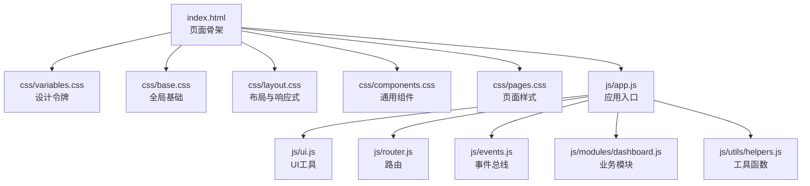
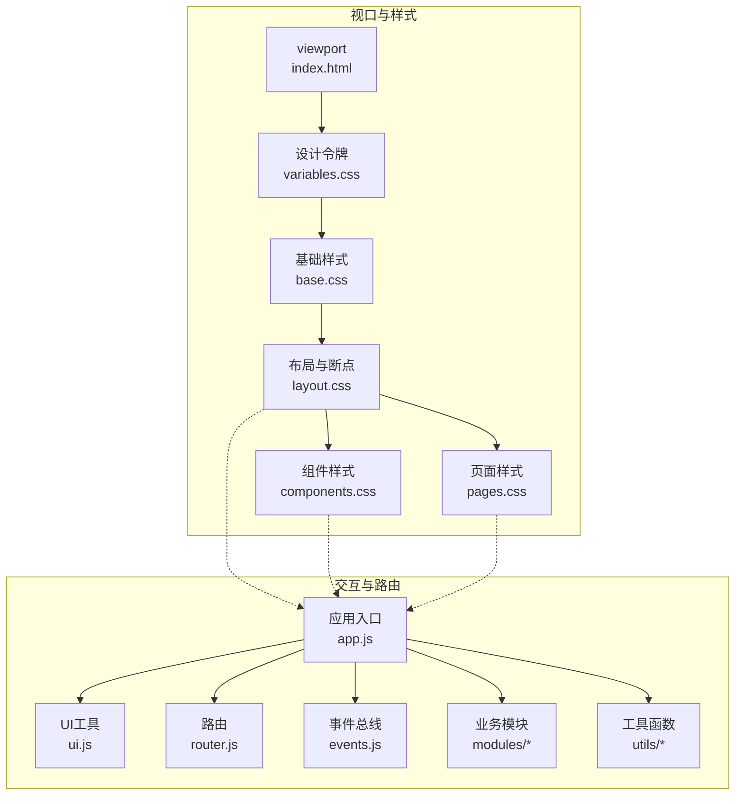
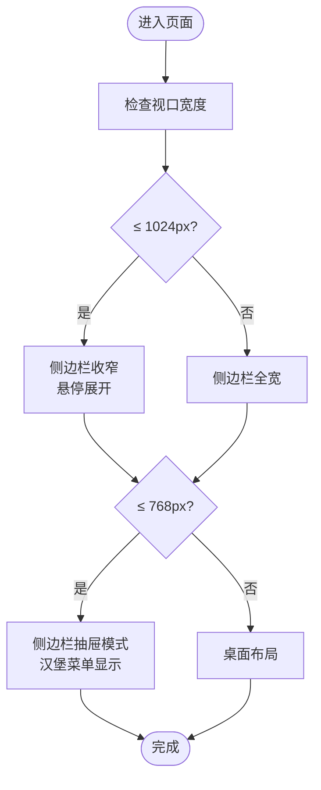
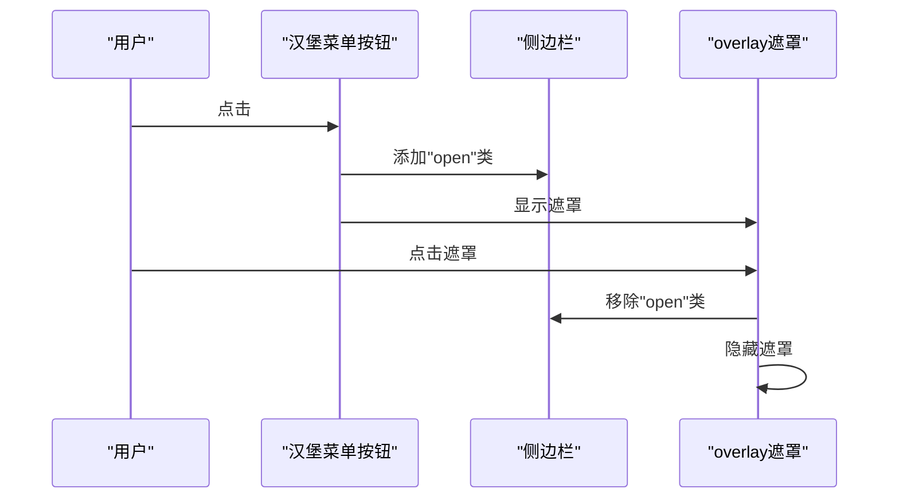
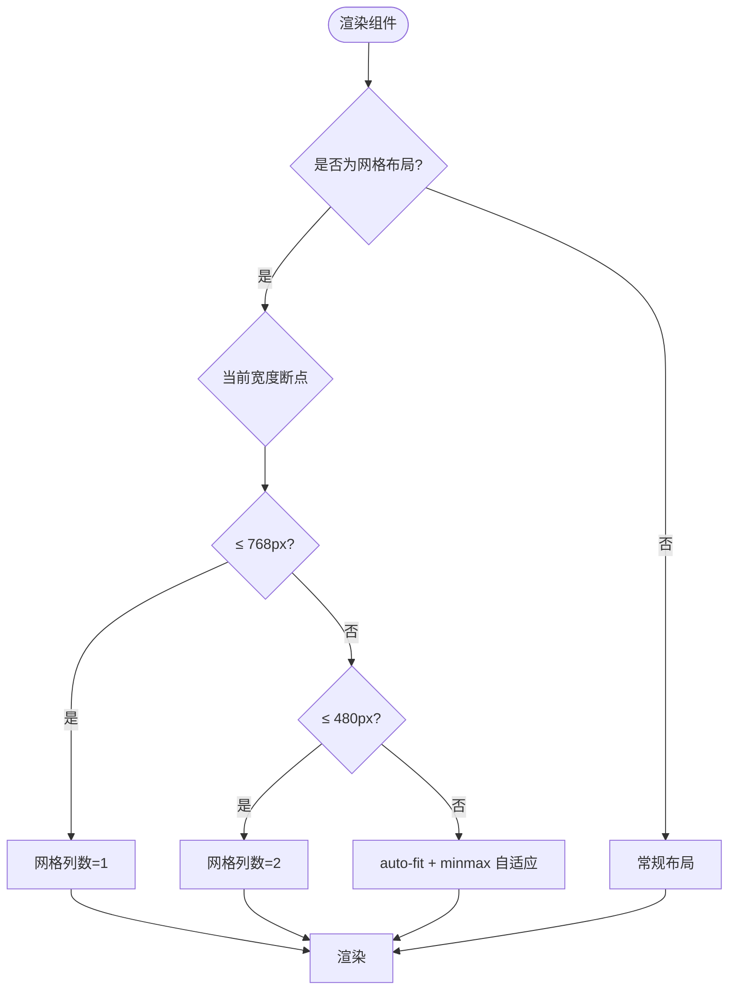
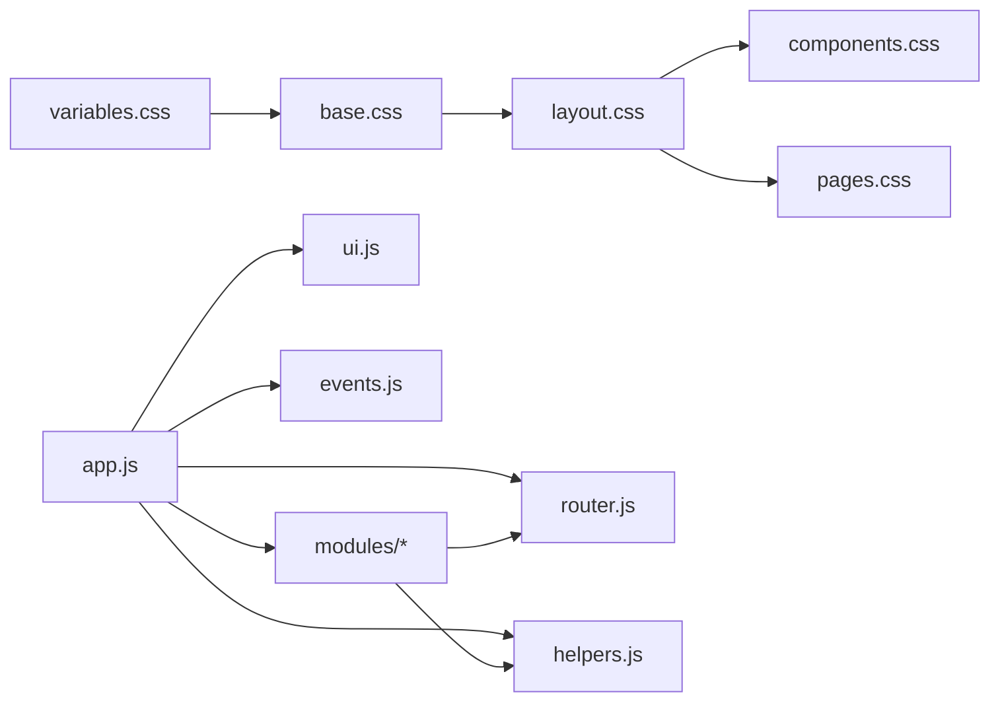

# 响应式设计

<cite>
**本文引用的文件**
- [index.html](file://index.html)
- [variables.css](file://css/variables.css)
- [base.css](file://css/base.css)
- [layout.css](file://css/layout.css)
- [components.css](file://css/components.css)
- [pages.css](file://css/pages.css)
- [app.js](file://js/app.js)
- [ui.js](file://js/ui.js)
- [router.js](file://js/router.js)
- [events.js](file://js/events.js)
- [helpers.js](file://js/utils/helpers.js)
- [dashboard.js](file://js/modules/dashboard.js)
</cite>

## 目录
1. [简介](#简介)
2. [项目结构](#项目结构)
3. [核心组件](#核心组件)
4. [架构总览](#架构总览)
5. [详细组件分析](#详细组件分析)
6. [依赖分析](#依赖分析)
7. [性能考量](#性能考量)
8. [故障排查指南](#故障排查指南)
9. [结论](#结论)
10. [附录](#附录)

## 简介
本文件面向CRM系统的响应式设计，系统采用“移动端优先”的设计理念，结合CSS变量、Flexbox与Grid、媒体查询以及原生JavaScript事件与路由机制，实现跨设备一致的用户体验。本文将从断点策略、媒体查询使用、移动端抽屉交互、网格与自适应布局、触摸交互优化、性能与加载策略、以及测试调试方法等方面进行全面阐述。

## 项目结构
系统采用“样式分层 + 模块化JS”的组织方式：
- 样式层：variables.css（设计令牌）、base.css（全局基础）、layout.css（布局）、components.css（通用组件）、pages.css（页面级样式）
- JS层：app.js（应用入口与初始化）、ui.js（UI工具集）、router.js（Hash路由）、events.js（事件总线）、modules/*（业务模块）、utils/*（工具）

图表来源
- [index.html:1-129](file://index.html#L1-L129)
- [variables.css:1-120](file://css/variables.css#L1-L120)
- [base.css:1-102](file://css/base.css#L1-L102)
- [layout.css:1-337](file://css/layout.css#L1-L337)
- [components.css:1-823](file://css/components.css#L1-L823)
- [pages.css:1-224](file://css/pages.css#L1-L224)
- [app.js:1-316](file://js/app.js#L1-L316)
- [ui.js:1-364](file://js/ui.js#L1-L364)
- [router.js:1-62](file://js/router.js#L1-L62)
- [events.js:1-36](file://js/events.js#L1-L36)
- [helpers.js:1-113](file://js/utils/helpers.js#L1-L113)
- [dashboard.js:1-220](file://js/modules/dashboard.js#L1-L220)

章节来源
- [index.html:1-129](file://index.html#L1-L129)
- [variables.css:1-120](file://css/variables.css#L1-L120)
- [layout.css:1-337](file://css/layout.css#L1-L337)

## 核心组件
- 设计令牌与主题：通过CSS变量统一管理颜色、字体、间距、阴影、圆角、布局尺寸等，便于在不同设备上保持视觉一致性。
- 布局系统：Flex布局主容器，配合固定顶栏、可折叠侧边栏、内容区滚动，适配桌面与移动场景。
- 响应式断点：以1024px与768px为主要断点，分别控制侧边栏宽度与移动端抽屉行为。
- 通用组件：按钮、表单、卡片、表格、模态框、Toast、标签页等，均内置响应式规则。
- 页面样式：仪表盘、详情页、订单明细等页面采用Grid与自适应布局，针对小屏进行列数缩减与方向调整。
- 交互与路由：移动端汉堡菜单、侧边栏抽屉、全局搜索下拉、面包屑与页面标题动态更新，均由UI工具与路由协同完成。

章节来源
- [variables.css:1-120](file://css/variables.css#L1-L120)
- [layout.css:1-337](file://css/layout.css#L1-L337)
- [components.css:1-823](file://css/components.css#L1-L823)
- [pages.css:1-224](file://css/pages.css#L1-L224)
- [ui.js:1-364](file://js/ui.js#L1-L364)
- [router.js:1-62](file://js/router.js#L1-L62)

## 架构总览
系统采用“视口优先 + 媒体查询 + 组件化样式 + 模块化JS”的响应式架构：
- 视口：在HTML中声明viewport元标签，确保移动端缩放与布局正确。
- 样式：以variables.css为设计令牌，base.css提供全局排版与动画，layout.css定义布局与响应式断点，components.css与pages.css细化组件与页面样式。
- 交互：app.js负责模块初始化、导航绑定、移动端侧边栏、全局搜索；ui.js提供UI工具（Toast、模态框、表单构建、页面标题设置）；router.js与events.js支撑SPA路由与事件通信。

图表来源
- [index.html:1-129](file://index.html#L1-L129)
- [variables.css:1-120](file://css/variables.css#L1-L120)
- [base.css:1-102](file://css/base.css#L1-L102)
- [layout.css:1-337](file://css/layout.css#L1-L337)
- [components.css:1-823](file://css/components.css#L1-L823)
- [pages.css:1-224](file://css/pages.css#L1-L224)
- [app.js:1-316](file://js/app.js#L1-L316)
- [ui.js:1-364](file://js/ui.js#L1-L364)
- [router.js:1-62](file://js/router.js#L1-L62)
- [events.js:1-36](file://js/events.js#L1-L36)

## 详细组件分析

### 响应式断点与媒体查询策略
- 断点设定
  - 1024px：侧边栏收窄至紧凑宽度，并在悬停时展开显示完整文案与徽标。
  - 768px：侧边栏改为固定抽屉模式，通过“open”类控制显隐；汉堡菜单按钮显示；顶栏搜索宽度缩小；页面头部方向改为纵向堆叠。
- 实现要点
  - 使用max-width媒体查询包裹侧边栏与顶栏相关规则，避免重复声明。
  - 抽屉通过transform平移与z-index层级控制，overlay遮罩用于点击外部关闭。
  - 顶栏搜索在小屏下缩短宽度，保证输入体验与空间利用。

图表来源
- [layout.css:291-336](file://css/layout.css#L291-L336)

章节来源
- [layout.css:291-336](file://css/layout.css#L291-L336)
- [index.html:1-129](file://index.html#L1-L129)

### 移动端优先与抽屉交互
- 移动端优先体现在：
  - 侧边栏默认隐藏于左侧外，通过transform向右平移至可视区域。
  - 汉堡菜单按钮仅在小屏显示，点击切换侧边栏open类。
  - overlay遮罩点击关闭抽屉，ESC键关闭模态框/抽屉。
- 交互流程
  - 点击汉堡菜单：为侧边栏添加open类，同时显示overlay。
  - 点击overlay或ESC：移除open类，隐藏抽屉。
  - 导航项点击：自动关闭抽屉，避免遮挡内容。

图表来源
- [ui.js:342-349](file://js/ui.js#L342-L349)
- [app.js:162-170](file://js/app.js#L162-L170)
- [index.html:79-108](file://index.html#L79-L108)
- [layout.css:316-336](file://css/layout.css#L316-L336)

章节来源
- [ui.js:318-349](file://js/ui.js#L318-L349)
- [app.js:162-170](file://js/app.js#L162-L170)
- [index.html:79-108](file://index.html#L79-L108)
- [layout.css:316-336](file://css/layout.css#L316-L336)

### 网格系统与自适应布局
- Grid与Auto-fit
  - 统计卡片、详情页信息卡、仪表盘网格等使用CSS Grid，通过auto-fit与minmax实现自适应列数。
  - 在768px以下，网格列数减少至1列；在480px以下，进一步减少至1列，保证内容可读性。
- 表单网格
  - 表单采用两列网格，小屏下自动变为单列，提升输入体验。
- 表格与卡片
  - 表格容器与卡片具备阴影与圆角，内容区溢出时启用横向滚动，确保在窄屏下仍可完整浏览。

图表来源
- [components.css:785-796](file://css/components.css#L785-L796)
- [pages.css:6-11](file://css/pages.css#L6-L11)
- [pages.css:215-223](file://css/pages.css#L215-L223)

章节来源
- [components.css:785-796](file://css/components.css#L785-L796)
- [pages.css:6-11](file://css/pages.css#L6-L11)
- [pages.css:215-223](file://css/pages.css#L215-L223)

### 触摸交互优化与手势支持
- 触摸目标尺寸
  - 按钮高度统一为36px，汉堡菜单与导航项均具备足够点击面积。
  - 侧边栏导航项在小屏下居中显示图标，大屏下显示文字与徽标，兼顾触控与阅读。
- 滚动与溢出
  - 侧边栏与内容区均启用垂直滚动，避免内容被遮挡。
  - 表格容器开启横向滚动，保障窄屏下可完整查看。
- 反馈与过渡
  - 所有交互元素具备过渡动画，提升触控反馈与流畅度。
  - Toast通知从右侧滑入，模态框缩放入场，增强触觉反馈。

章节来源
- [layout.css:13-144](file://css/layout.css#L13-L144)
- [components.css:1-823](file://css/components.css#L1-L823)
- [ui.js:48-78](file://js/ui.js#L48-L78)

### 不同设备尺寸下的用户体验优化
- 大屏（>1024px）
  - 侧边栏全宽显示，导航项显示文字与徽标，悬停展开完整内容。
  - 页面头部水平排列，内容区留白充足。
- 中屏（768px–1024px）
  - 侧边栏收窄，悬停展开；顶栏搜索宽度适中；页面头部纵向堆叠。
- 小屏（≤768px）
  - 侧边栏抽屉模式；汉堡菜单显示；overlay遮罩；内容区内边距减小。
- 超小屏（≤480px）
  - 统计卡片与详情页信息卡列数进一步减少至1列，确保可读性与可操作性。

章节来源
- [layout.css:291-336](file://css/layout.css#L291-L336)
- [pages.css:215-223](file://css/pages.css#L215-L223)
- [components.css:785-796](file://css/components.css#L785-L796)

### 性能考量与加载优化策略
- 样式层面
  - 使用CSS变量集中管理设计令牌，减少重复计算与维护成本。
  - Flex与Grid组合减少复杂定位逻辑，降低重绘与回流。
  - 动画使用CSS transition与keyframes，避免JavaScript动画带来的性能损耗。
- 交互层面
  - 全局搜索采用防抖（200ms），减少频繁查询与DOM操作。
  - 模态框与Toast使用一次性插入与移除，避免长生命周期DOM节点。
- 资源层面
  - SVG图标内联，减少HTTP请求；按钮与表单项复用组件，避免重复定义。
  - 页面骨架在内容区占位，提升感知速度。

章节来源
- [helpers.js:63-70](file://js/utils/helpers.js#L63-L70)
- [ui.js:48-78](file://js/ui.js#L48-L78)
- [variables.css:1-120](file://css/variables.css#L1-L120)
- [layout.css:1-337](file://css/layout.css#L1-L337)

### 响应式测试与调试方法
- 浏览器开发者工具
  - 使用设备模拟器（iPhone、iPad等）快速切换断点，观察布局变化。
  - 网络面板监控资源加载，确认SVG与脚本加载情况。
- 样式调试
  - 使用Elements面板检查媒体查询生效范围，定位布局异常。
  - 通过CSS变量面板修改设计令牌，快速验证主题与间距效果。
- 交互调试
  - 在Console中调用UI工具方法（如UI.toast、UI.modal）验证交互反馈。
  - 通过Events面板监听路由事件与数据变更事件，确认SPA行为。
- 性能分析
  - 使用Performance面板录制交互过程，识别长任务与重绘热点。
  - 使用Coverage面板检查未使用的CSS规则，减少体积。

## 依赖分析
- 样式依赖
  - layout.css依赖variables.css中的设计令牌；components.css与pages.css依赖layout.css的布局基线。
- 交互依赖
  - app.js依赖ui.js（UI工具）、router.js（路由）、events.js（事件总线）、helpers.js（工具函数）。
  - dashboard.js作为业务模块，依赖store与helpers，通过router注册路由。

图表来源
- [variables.css:1-120](file://css/variables.css#L1-L120)
- [base.css:1-102](file://css/base.css#L1-L102)
- [layout.css:1-337](file://css/layout.css#L1-L337)
- [components.css:1-823](file://css/components.css#L1-L823)
- [pages.css:1-224](file://css/pages.css#L1-L224)
- [app.js:1-316](file://js/app.js#L1-L316)
- [ui.js:1-364](file://js/ui.js#L1-L364)
- [router.js:1-62](file://js/router.js#L1-L62)
- [events.js:1-36](file://js/events.js#L1-L36)
- [helpers.js:1-113](file://js/utils/helpers.js#L1-L113)
- [dashboard.js:1-220](file://js/modules/dashboard.js#L1-L220)

章节来源
- [app.js:1-41](file://js/app.js#L1-L41)
- [dashboard.js:211-218](file://js/modules/dashboard.js#L211-L218)

## 性能考量
- 减少重绘与回流
  - 使用transform与opacity动画替代改变布局属性的动画。
  - Grid与Flex布局优于绝对定位，降低复杂计算。
- 控制DOM数量
  - 通过组件复用与条件渲染，避免大量临时节点。
- 资源优化
  - SVG内联与懒加载策略（如需要）结合，减少网络开销。
- 交互节流
  - 搜索与窗口resize事件采用防抖/节流，避免高频触发。

## 故障排查指南
- 侧边栏不显示/无法关闭
  - 检查汉堡菜单按钮是否正确绑定事件，overlay遮罩是否显示。
  - 确认sidebar与overlay的z-index层级关系。
- 搜索结果不出现
  - 检查全局搜索输入框是否绑定事件，防抖延迟是否合理。
  - 确认结果容器插入位置与点击外部关闭逻辑。
- 页面标题与面包屑不更新
  - 检查UI.setPageTitle调用时机与参数，确认事件总线是否触发路由变更。
- 路由不生效
  - 检查Router.register与start是否正确调用，hashchange事件是否监听。

章节来源
- [app.js:63-160](file://js/app.js#L63-L160)
- [ui.js:318-349](file://js/ui.js#L318-L349)
- [router.js:54-60](file://js/router.js#L54-L60)

## 结论
该CRM系统以“移动端优先”为核心策略，通过清晰的断点划分、灵活的网格系统、完善的组件化样式与模块化的JS交互，实现了在多设备上的统一体验。借助CSS变量与媒体查询，系统在桌面与移动场景下均具备良好的可读性与可用性；通过防抖与轻量级动画，提升了交互流畅度与性能表现。建议在后续迭代中持续关注超小屏的可读性与触控可达性，并引入更完善的自动化测试与性能监控体系。

## 附录
- 断点参考
  - 1024px：侧边栏收窄与悬停展开
  - 768px：侧边栏抽屉模式与汉堡菜单
  - 640px：表单网格单列
  - 480px：统计卡片与详情页信息卡单列
- 设计令牌
  - 颜色、字体、间距、圆角、阴影、布局尺寸、过渡时间等均通过CSS变量集中管理，便于主题定制与一致性维护。