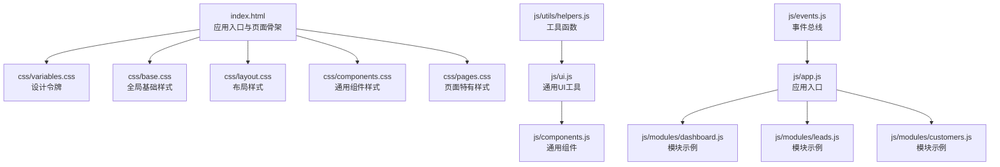
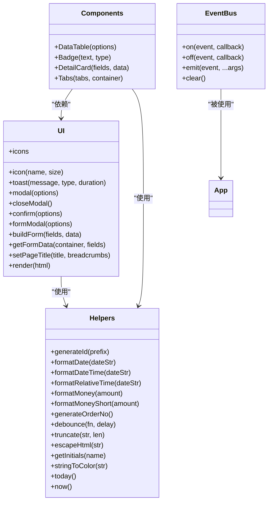
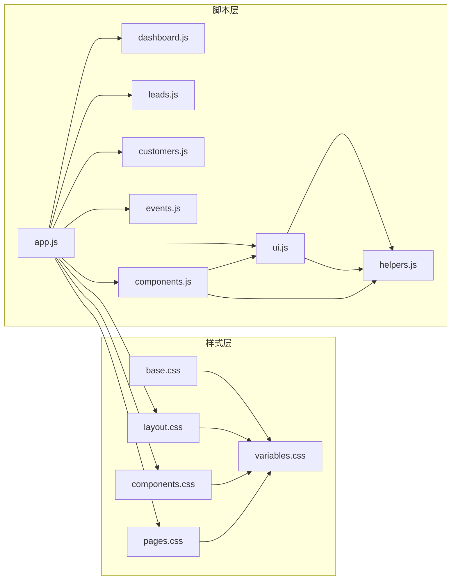

# 用户界面组件

<cite>
**本文引用的文件**
- [index.html](file://index.html)
- [variables.css](file://css/variables.css)
- [base.css](file://css/base.css)
- [layout.css](file://css/layout.css)
- [components.css](file://css/components.css)
- [pages.css](file://css/pages.css)
- [ui.js](file://js/ui.js)
- [components.js](file://js/components.js)
- [helpers.js](file://js/utils/helpers.js)
- [events.js](file://js/events.js)
- [app.js](file://js/app.js)
- [dashboard.js](file://js/modules/dashboard.js)
- [leads.js](file://js/modules/leads.js)
- [customers.js](file://js/modules/customers.js)
</cite>

## 目录
1. [简介](#简介)
2. [项目结构](#项目结构)
3. [核心组件](#核心组件)
4. [架构总览](#架构总览)
5. [详细组件分析](#详细组件分析)
6. [依赖关系分析](#依赖关系分析)
7. [性能考量](#性能考量)
8. [故障排查指南](#故障排查指南)
9. [结论](#结论)
10. [附录](#附录)

## 简介
本文件面向CRM系统的用户界面组件，系统性梳理UI模块的设计理念、组件系统架构、响应式与移动端适配策略、CSS架构（设计令牌、原子化样式与组件样式组织）、组件功能特性与API、使用示例与最佳实践，以及主题系统与视觉设计规范。目标是帮助开发者与产品人员快速理解并高效使用UI组件体系。

## 项目结构
- 视图层以HTML模板与CSS类为主，JS模块负责业务逻辑与交互。
- UI层通过统一的工具模块（UI、Components）封装通用交互与组件渲染，避免重复开发。
- 样式采用“设计令牌 + 原子化 + 组件化”的分层组织，确保一致性与可维护性。
- 响应式布局基于媒体查询与CSS变量，兼顾桌面与移动端体验。

图表来源
- [index.html:1-129](file://index.html#L1-L129)
- [variables.css:1-120](file://css/variables.css#L1-L120)
- [base.css:1-102](file://css/base.css#L1-L102)
- [layout.css:1-337](file://css/layout.css#L1-L337)
- [components.css:1-823](file://css/components.css#L1-L823)
- [pages.css:1-224](file://css/pages.css#L1-L224)
- [ui.js:1-364](file://js/ui.js#L1-L364)
- [components.js:1-324](file://js/components.js#L1-L324)
- [helpers.js:1-113](file://js/utils/helpers.js#L1-L113)
- [events.js:1-36](file://js/events.js#L1-L36)
- [app.js:1-316](file://js/app.js#L1-L316)
- [dashboard.js:1-220](file://js/modules/dashboard.js#L1-L220)
- [leads.js:1-286](file://js/modules/leads.js#L1-L286)
- [customers.js:1-229](file://js/modules/customers.js#L1-L229)

章节来源
- [index.html:1-129](file://index.html#L1-L129)
- [layout.css:1-337](file://css/layout.css#L1-L337)

## 核心组件
- UI工具集（UI）：提供图标库、Toast通知、模态框、确认框、表单构建与校验、面包屑与页面标题设置、内容渲染等。
- 通用组件（Components）：提供数据表格、状态标签、详情卡片、标签页等复用组件。
- 工具函数（Helpers）：提供日期格式化、金额格式化、防抖、HTML转义、颜色哈希、ID生成等。
- 事件总线（EventBus）：模块间解耦通信，支持通配符事件。
- 应用入口（App）：初始化模块、注册路由、绑定导航与搜索、移动端侧边栏、监听路由变化更新导航高亮。

章节来源
- [ui.js:1-364](file://js/ui.js#L1-L364)
- [components.js:1-324](file://js/components.js#L1-L324)
- [helpers.js:1-113](file://js/utils/helpers.js#L1-L113)
- [events.js:1-36](file://js/events.js#L1-L36)
- [app.js:1-316](file://js/app.js#L1-L316)

## 架构总览
- 设计令牌（CSS变量）：集中定义主色、语义色、中性色、背景、文字、边框、阴影、圆角、间距、布局、字体、过渡、Z-index等，保证主题一致性与可扩展性。
- 原子化样式：通过类名组合实现一致的尺寸、间距、颜色与排版，降低重复样式编写。
- 组件样式：在原子化基础上，形成卡片、表格、标签、模态框、Toast、Tabs等组件的稳定外观。
- 交互与行为：UI工具与Components组件封装交互逻辑，模块通过Router与Store协作完成数据驱动的视图渲染。

图表来源
- [ui.js:1-364](file://js/ui.js#L1-L364)
- [components.js:1-324](file://js/components.js#L1-L324)
- [helpers.js:1-113](file://js/utils/helpers.js#L1-L113)
- [events.js:1-36](file://js/events.js#L1-L36)

## 详细组件分析

### 设计令牌系统（CSS变量）
- 主色调与语义色：通过HSL变量定义主色与成功/警告/危险/信息等语义色，配套浅色背景与前景色，便于在组件中直接复用。
- 中性色与背景：提供从50到900的灰阶，用于背景、卡片、边框与文字色，确保对比度与层次感。
- 布局与尺寸：定义侧边栏宽度、折叠宽度、顶栏高度、圆角半径、间距步进、字体族与字号、过渡时长、Z-index层级，支撑响应式布局与组件定位。
- 阴影与滚动条：统一阴影与滚动条样式，提升视觉一致性与可用性。

章节来源
- [variables.css:1-120](file://css/variables.css#L1-L120)

### 原子化样式与组件样式组织
- 原子化：按钮、表单、网格、间距、圆角、阴影等通过类名组合实现，减少重复样式，提高复用性。
- 组件化：在原子化基础上，形成卡片、数据表格、标签、模态框、Toast、Tabs等组件的稳定外观与交互。
- 页面特有样式：Dashboard、详情页、搜索结果等页面级样式独立维护，避免污染通用组件。

章节来源
- [base.css:1-102](file://css/base.css#L1-L102)
- [components.css:1-823](file://css/components.css#L1-L823)
- [pages.css:1-224](file://css/pages.css#L1-L224)

### 响应式设计与移动端适配
- 侧边栏折叠：在中等屏幕下（max-width: 1024px）收起文字与徽标，悬停展开；在小屏（max-width: 768px）改为抽屉式侧边栏，支持遮罩与手势关闭。
- 顶栏搜索：在小屏下缩小搜索框宽度，内容区域调整内边距。
- 卡片与网格：在小屏下网格自动变为单列，统计卡片与仪表盘网格按断点调整列数。
- 动画与过渡：统一使用CSS变量控制过渡时长，配合动画类实现平滑交互。

章节来源
- [layout.css:291-337](file://css/layout.css#L291-L337)
- [pages.css:215-224](file://css/pages.css#L215-L224)

### 通用UI工具（UI）
- 图标库：内置常用SVG图标，支持按尺寸输出。
- Toast通知：支持成功/错误/警告/信息四种类型，自动移除与定时关闭。
- 模态框：支持不同尺寸、自定义内容与底部按钮，ESC键关闭，点击遮罩关闭。
- 确认框：内置确认/取消流程，支持危险/警告/成功类型。
- 表单模态框：根据字段定义动态生成表单，内置必填校验与错误提示。
- 页面标题与面包屑：动态设置页面标题与面包屑导航，支持返回按钮与侧边栏开关。
- 内容渲染：统一渲染入口，支持字符串与DOM节点。

章节来源
- [ui.js:1-364](file://js/ui.js#L1-L364)

### 通用组件（Components）
- 数据表格（DataTable）：支持搜索、筛选、排序、分页、行点击、操作按钮（查看/编辑/删除/自定义），列可配置宽度与渲染器，空状态友好。
- 状态标签（Badge）：支持多种类型（primary/success/warning/danger/info/gray），配合点状徽标。
- 详情卡片（DetailCard）：按字段渲染只读详情，支持自定义渲染器。
- 标签页（Tabs）：支持多标签切换，动态渲染内容面板。

章节来源
- [components.js:1-324](file://js/components.js#L1-L324)

### 工具函数（Helpers）
- 日期与时间：格式化日期、日期时间、相对时间。
- 金额：格式化人民币与简写（万元）。
- 订单号：基于本地存储计数器生成唯一订单号。
- 防抖：通用防抖函数，常用于搜索与输入。
- HTML转义：防止XSS，安全渲染用户输入。
- 颜色哈希：根据字符串生成固定色系，用于头像占位。
- 其他：生成ID、截断文本、获取首字母、今日与当前时间。

章节来源
- [helpers.js:1-113](file://js/utils/helpers.js#L1-L113)

### 事件总线（EventBus）
- 支持订阅/取消订阅/发布，含通配符事件（如 data:changed:*），便于模块间解耦通信。

章节来源
- [events.js:1-36](file://js/events.js#L1-L36)

### 应用入口（App）
- 初始化种子数据、注册模块路由、绑定导航与全局搜索、移动端侧边栏、启动路由并监听路由变化更新导航高亮。
- 提供系统设置页面，支持数据导出/导入/重置/清空，展示各集合数量统计。

章节来源
- [app.js:1-316](file://js/app.js#L1-L316)

### 模块示例（Dashboard/Leads/Customers）
- Dashboard：统计卡片、销售漏斗、线索来源分布、待办提醒、最近活动，支持刷新与自动更新。
- Leads：线索列表（搜索/筛选/排序/分页/行点击/操作）、详情页（基本信息/跟进记录/转化）、表单新增/编辑/删除、转化客户。
- Customers：客户列表（搜索/筛选/排序/分页/行点击/操作）、详情页（基本信息/联系人/商机/订单/跟进记录）、表单新增/编辑/删除。

章节来源
- [dashboard.js:1-220](file://js/modules/dashboard.js#L1-L220)
- [leads.js:1-286](file://js/modules/leads.js#L1-L286)
- [customers.js:1-229](file://js/modules/customers.js#L1-L229)

## 依赖关系分析

图表来源
- [variables.css:1-120](file://css/variables.css#L1-L120)
- [base.css:1-102](file://css/base.css#L1-L102)
- [layout.css:1-337](file://css/layout.css#L1-L337)
- [components.css:1-823](file://css/components.css#L1-L823)
- [pages.css:1-224](file://css/pages.css#L1-L224)
- [ui.js:1-364](file://js/ui.js#L1-L364)
- [components.js:1-324](file://js/components.js#L1-L324)
- [helpers.js:1-113](file://js/utils/helpers.js#L1-L113)
- [events.js:1-36](file://js/events.js#L1-L36)
- [app.js:1-316](file://js/app.js#L1-L316)
- [dashboard.js:1-220](file://js/modules/dashboard.js#L1-L220)
- [leads.js:1-286](file://js/modules/leads.js#L1-L286)
- [customers.js:1-229](file://js/modules/customers.js#L1-L229)

## 性能考量
- 防抖优化：全局搜索与输入事件使用防抖，降低频繁计算与渲染压力。
- 虚拟滚动与分页：数据表格内置分页与范围渲染，避免一次性渲染大量行。
- 事件委托：在表格与列表中优先使用事件委托，减少事件监听器数量。
- CSS变量与原子化：通过CSS变量与原子类减少重复样式，提升样式层性能与可维护性。
- 模态框与遮罩：仅在需要时创建DOM节点，避免常驻内存造成资源浪费。

## 故障排查指南
- 模态框无法关闭：检查是否正确调用关闭方法或绑定ESC事件；确认遮罩点击事件是否生效。
- 表单校验不生效：确认字段定义中的required与类型是否正确；检查getFormData返回值与错误提示插入位置。
- 数据表格无数据：检查传入data是否为空；确认搜索/筛选条件是否导致过滤后为空。
- 响应式异常：检查媒体查询断点与CSS变量是否正确；确认容器类名是否正确。
- 导航高亮不更新：确认路由变化事件是否触发；检查updateActiveNav逻辑与模块路由匹配。

章节来源
- [ui.js:80-135](file://js/ui.js#L80-L135)
- [components.js:184-260](file://js/components.js#L184-L260)
- [app.js:54-61](file://js/app.js#L54-L61)

## 结论
该UI组件体系以设计令牌为核心，结合原子化与组件化样式，辅以统一的UI工具与通用组件，实现了跨模块的一致性与高复用性。响应式与移动端适配策略清晰，事件总线与模块化路由使系统具备良好的扩展性。建议在后续迭代中持续完善组件API文档与主题扩展机制，进一步提升可维护性与可定制性。

## 附录

### 组件API参考（UI工具）

- 图标
  - 方法：icon(name, size?)
  - 参数：name（图标名）、size（可选，像素）
  - 返回：SVG字符串或带尺寸的span

- Toast通知
  - 方法：toast(message, type?, duration?)
  - 参数：message（消息文本）、type（success/error/warning/info，默认success）、duration（毫秒，默认3000）
  - 行为：自动创建容器、插入DOM、定时移除

- 模态框
  - 方法：modal({ title, content, size?, onClose?, footer? })
  - 参数：title（标题）、content（字符串或DOM）、size（lg/default/sm）、onClose（关闭回调）、footer（底部按钮HTML）
  - 返回：overlay（遮罩DOM）与close方法

- 关闭模态框
  - 方法：closeModal()

- 确认框
  - 方法：confirm({ title, message, type?, confirmText?, cancelText?, onConfirm? })
  - 参数：type（danger/warning/success）、confirmText/cancelText、onConfirm（确认回调）

- 表单模态框
  - 方法：formModal({ title, fields, data?, size?, onSubmit? })
  - 参数：fields（字段定义数组）、data（默认值）、onSubmit（提交回调）

- 表单构建与校验
  - 方法：buildForm(fields, data?)、getFormData(container, fields)
  - 行为：根据字段类型生成表单，内置必填校验与错误提示

- 页面标题与面包屑
  - 方法：setPageTitle(title, breadcrumbs?)
  - 行为：动态设置标题与面包屑，支持返回按钮与侧边栏开关

- 内容渲染
  - 方法：render(html)
  - 行为：向内容区插入HTML或DOM节点

章节来源
- [ui.js:41-363](file://js/ui.js#L41-L363)

### 组件API参考（Components）

- 数据表格（DataTable）
  - 参数：
    - columns（[{ key, label, width, sortable, render }]）
    - data（数组）
    - pageSize（默认15）、currentPage（默认1）
    - searchKeys（搜索字段数组）、searchPlaceholder（默认“搜索...”）
    - filters（快捷筛选标签）、activeFilter（当前激活值）、onFilterChange（切换回调）
    - actions（{ onView, onEdit, onDelete } 或自定义render）
    - toolbarExtra（工具栏额外HTML）、emptyText（默认“暂无数据”）
    - onRowClick（行点击回调）
    - sortKey、sortOrder（'asc' | 'desc'）、onSort（排序回调）
  - 返回：表格DOM容器，包含refresh(newData)方法

- 状态标签（Badge）
  - 参数：text（文本）、type（'gray' | 'primary' | 'success' | 'warning' | 'danger' | 'info'）
  - 返回：HTML字符串

- 详情卡片（DetailCard）
  - 参数：fields（[{ key, label, render? }]）、data（对象）
  - 返回：HTML字符串

- 标签页（Tabs）
  - 参数：tabs（[{ label, render() }]）、container（容器DOM）
  - 返回：{ switchTo(idx) }（切换到指定标签）

章节来源
- [components.js:6-323](file://js/components.js#L6-L323)

### 使用示例与最佳实践

- 在模块中渲染数据表格
  - 步骤：准备columns与data，调用Components.DataTable，挂载到容器，绑定操作回调与排序回调。
  - 注意：合理设置searchKeys与filters，避免大数据量时的性能问题。

- 使用Toast通知
  - 步骤：UI.toast(message, type, duration)；根据场景选择success/error/warning/info。

- 使用模态框与确认框
  - 步骤：UI.modal(...)或UI.confirm(...)；在footer中放置按钮，绑定点击事件；确认框支持自定义确认文案与回调。

- 使用表单模态框
  - 步骤：定义fields数组（含key/label/type/required/options等），调用UI.formModal；在onSubmit中处理数据提交与路由跳转。

- 设置页面标题与面包屑
  - 步骤：UI.setPageTitle(title, breadcrumbs?)；面包屑支持链接与纯文本混合。

- 最佳实践
  - 使用CSS变量统一颜色与尺寸，避免硬编码。
  - 表单字段尽量使用必填与类型约束，结合getFormData进行校验。
  - 大数据量场景优先使用分页与防抖，避免阻塞主线程。
  - 组件间通信使用EventBus，避免强耦合。

章节来源
- [leads.js:43-86](file://js/modules/leads.js#L43-L86)
- [customers.js:45-92](file://js/modules/customers.js#L45-L92)
- [ui.js:48-191](file://js/ui.js#L48-L191)

### 主题系统与视觉设计规范
- 主色调：通过HSL变量定义主色与明暗变体，配套前景色，确保在不同背景下具备足够对比度。
- 语义色：success/warning/danger/info分别对应成功/警告/危险/信息状态，用于状态标签与按钮。
- 中性色：提供从50到900的灰阶，用于背景、卡片、边框与文字色，确保层次清晰。
- 字体与字号：使用系统字体栈与多级字号，保证可读性与一致性。
- 圆角与阴影：统一圆角半径与阴影层级，营造现代感与深度感。
- 间距：使用步进式间距变量，确保布局的节奏感与对齐一致性。
- 响应式：通过媒体查询与CSS变量，实现侧边栏折叠、网格自适应与移动端抽屉式导航。

章节来源
- [variables.css:5-119](file://css/variables.css#L5-L119)
- [layout.css:291-337](file://css/layout.css#L291-L337)