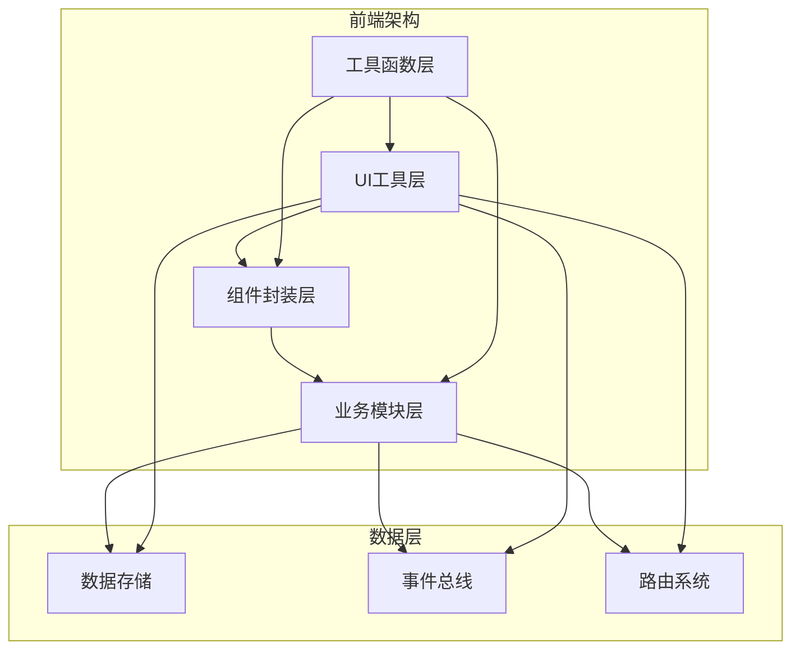
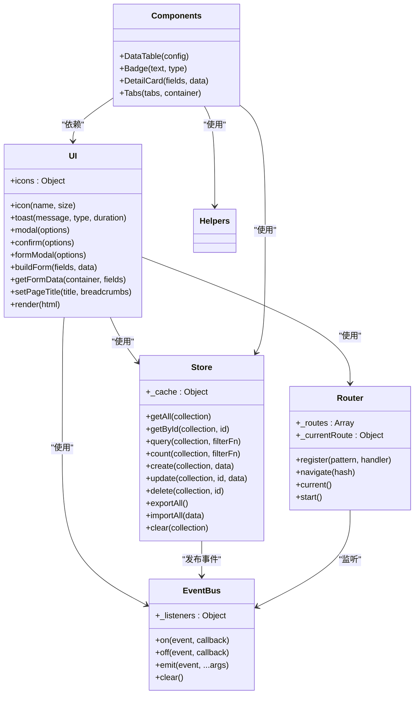
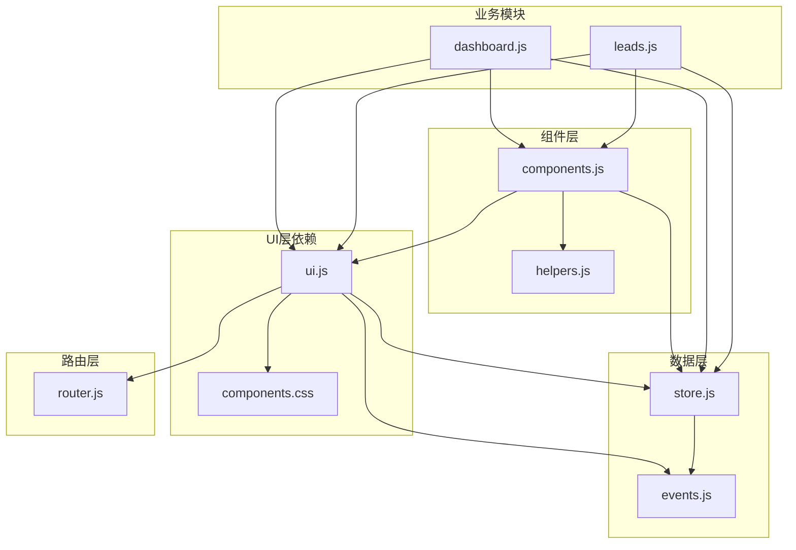

# 组件API参考

<cite>
**本文档引用的文件**
- [ui.js](file://js/ui.js)
- [components.js](file://js/components.js)
- [helpers.js](file://js/utils/helpers.js)
- [store.js](file://js/store.js)
- [events.js](file://js/events.js)
- [router.js](file://js/router.js)
- [dashboard.js](file://js/modules/dashboard.js)
- [leads.js](file://js/modules/leads.js)
- [index.html](file://index.html)
- [components.css](file://css/components.css)
</cite>

## 目录
1. [简介](#简介)
2. [项目结构](#项目结构)
3. [核心组件](#核心组件)
4. [架构概览](#架构概览)
5. [详细组件分析](#详细组件分析)
6. [依赖关系分析](#依赖关系分析)
7. [性能考虑](#性能考虑)
8. [故障排除指南](#故障排除指南)
9. [结论](#结论)
10. [附录](#附录)

## 简介
本文件为CRM系统UI组件API参考文档，涵盖所有UI组件的完整API规范，包括方法签名、参数说明、返回值类型和使用示例。详细描述每个组件的配置选项和属性设置，解释组件的生命周期和事件回调机制，并提供组件使用的最佳实践和常见问题解决方案。包含组件组合使用的示例和模式，解释组件的可访问性特性和键盘导航支持，以及组件调试和故障排除指南。

## 项目结构
CRM系统采用模块化架构，主要分为以下层次：
- **UI层**：提供通用UI工具和组件封装
- **业务模块层**：各功能模块的业务逻辑实现
- **数据层**：本地存储和数据管理
- **工具层**：辅助函数和实用工具



**图表来源**
- [ui.js:1-364](file://js/ui.js#L1-L364)
- [components.js:1-324](file://js/components.js#L1-L324)
- [store.js:1-139](file://js/store.js#L1-L139)
- [events.js:1-36](file://js/events.js#L1-L36)
- [router.js:1-62](file://js/router.js#L1-L62)

**章节来源**
- [index.html:1-129](file://index.html#L1-L129)
- [ui.js:1-364](file://js/ui.js#L1-L364)
- [components.js:1-324](file://js/components.js#L1-L324)

## 核心组件
系统提供以下核心UI组件：

### 1. UI工具类 (UI)
提供通用UI功能，包括图标管理、通知、模态框、表单处理等。

### 2. 通用组件 (Components)
提供可复用的UI组件，包括数据表格、状态标签、详情卡片、标签页等。

### 3. 工具函数 (Helpers)
提供常用的工具方法，如ID生成、日期格式化、防抖等。

### 4. 数据存储 (Store)
提供本地存储封装，支持CRUD操作和数据持久化。

### 5. 事件总线 (EventBus)
提供事件发布订阅机制，支持组件间通信。

### 6. 路由系统 (Router)
提供基于hash的路由管理，支持参数解析和导航。

**章节来源**
- [ui.js:4-364](file://js/ui.js#L4-L364)
- [components.js:4-324](file://js/components.js#L4-L324)
- [helpers.js:1-113](file://js/utils/helpers.js#L1-L113)
- [store.js:1-139](file://js/store.js#L1-L139)
- [events.js:1-36](file://js/events.js#L1-L36)
- [router.js:1-62](file://js/router.js#L1-L62)

## 架构概览
系统采用分层架构，各层职责清晰，通过事件总线实现松耦合通信。



**图表来源**
- [ui.js:4-364](file://js/ui.js#L4-L364)
- [components.js:4-324](file://js/components.js#L4-L324)
- [store.js:4-139](file://js/store.js#L4-L139)
- [events.js:4-36](file://js/events.js#L4-L36)
- [router.js:4-62](file://js/router.js#L4-L62)

## 详细组件分析

### UI工具类 (UI)

#### 图标系统
UI提供统一的SVG图标库，支持动态尺寸调整。

**API规范**
- 方法: `icon(name, size)`
- 参数:
  - `name`: 图标名称 (string)
  - `size`: 图标尺寸 (number, 可选)
- 返回值: SVG图标HTML字符串
- 使用示例: `UI.icon('dashboard', 20)`

**章节来源**
- [ui.js:6-46](file://js/ui.js#L6-L46)

#### 通知系统 (Toast)
提供多种类型的提示通知，支持自动消失和手动关闭。

**API规范**
- 方法: `toast(message, type, duration)`
- 参数:
  - `message`: 提示消息 (string)
  - `type`: 通知类型 ('success' | 'error' | 'warning' | 'info')
  - `duration`: 显示时长 (number, 毫秒)
- 返回值: void
- 使用示例: `UI.toast('操作成功', 'success', 3000)`

**章节来源**
- [ui.js:49-78](file://js/ui.js#L49-L78)

#### 模态框系统
提供灵活的模态框组件，支持自定义内容和回调。

**API规范**
- 方法: `modal(options)`
- 参数对象属性:
  - `title`: 标题 (string)
  - `content`: 内容 (string | HTMLElement)
  - `size`: 尺寸 ('sm' | 'lg' | 'default')
  - `onClose`: 关闭回调 (function)
  - `footer`: 底部内容 (string)
- 返回值: `{ overlay, close }`
- 使用示例: 
```javascript
const { close } = UI.modal({
  title: '确认删除',
  content: '确定要删除这条记录吗？',
  footer: '<button>确认</button>'
});
```

**章节来源**
- [ui.js:81-134](file://js/ui.js#L81-L134)

#### 确认框
提供标准化的确认对话框，支持不同类型的警告样式。

**API规范**
- 方法: `confirm(options)`
- 参数对象属性:
  - `title`: 标题 (string)
  - `message`: 提示信息 (string)
  - `type`: 类型 ('danger' | 'warning' | 'success')
  - `confirmText`: 确认按钮文本 (string)
  - `cancelText`: 取消按钮文本 (string)
  - `onConfirm`: 确认回调 (function)
- 返回值: void

**章节来源**
- [ui.js:137-162](file://js/ui.js#L137-L162)

#### 表单模态框
提供完整的表单处理能力，包含验证和提交逻辑。

**API规范**
- 方法: `formModal(options)`
- 参数对象属性:
  - `title`: 标题 (string)
  - `fields`: 字段定义数组 (Array)
  - `data`: 默认数据 (Object)
  - `size`: 尺寸 (string)
  - `onSubmit`: 提交回调 (function)
- 返回值: `{ overlay, close }`
- 字段定义属性:
  - `key`: 字段键名 (string)
  - `label`: 字段标签 (string)
  - `type`: 输入类型 (string)
  - `required`: 是否必填 (boolean)
  - `options`: 选项数组 (Array)
  - `placeholder`: 占位符 (string)
  - `disabled`: 是否禁用 (boolean)
  - `default`: 默认值 (any)

**章节来源**
- [ui.js:165-191](file://js/ui.js#L165-L191)

#### 表单构建器
内部用于构建复杂表单的工具函数。

**API规范**
- 方法: `buildForm(fields, data)`
- 参数:
  - `fields`: 字段定义数组 (Array)
  - `data`: 默认数据 (Object)
- 返回值: HTMLElement

**章节来源**
- [ui.js:194-274](file://js/ui.js#L194-L274)

#### 表单数据获取
表单验证和数据提取的核心方法。

**API规范**
- 方法: `getFormData(container, fields)`
- 参数:
  - `container`: 表单容器 (HTMLElement)
  - `fields`: 字段定义数组 (Array)
- 返回值: Object | null
- 验证规则:
  - 必填字段检查
  - 数字类型转换
  - 错误状态标记

**章节来源**
- [ui.js:277-316](file://js/ui.js#L277-L316)

#### 页面标题设置
动态设置页面标题和面包屑导航。

**API规范**
- 方法: `setPageTitle(title, breadcrumbs)`
- 参数:
  - `title`: 页面标题 (string)
  - `breadcrumbs`: 面包屑数组 (Array)
- 返回值: void

**章节来源**
- [ui.js:319-349](file://js/ui.js#L319-L349)

#### 内容渲染
统一的内容渲染接口。

**API规范**
- 方法: `render(html)`
- 参数:
  - `html`: HTML内容 (string | HTMLElement)
- 返回值: void

**章节来源**
- [ui.js:352-362](file://js/ui.js#L352-L362)

### 通用组件 (Components)

#### 数据表格组件 (DataTable)
功能完整的数据表格组件，支持搜索、排序、分页、筛选等功能。

**API规范**
- 方法: `DataTable(config)`
- 配置对象属性:
  - `columns`: 列定义数组 (Array)
  - `data`: 数据数组 (Array)
  - `pageSize`: 每页大小 (number, 默认15)
  - `currentPage`: 当前页码 (number, 默认1)
  - `searchKeys`: 搜索字段数组 (Array)
  - `searchPlaceholder`: 搜索占位符 (string)
  - `filters`: 筛选标签数组 (Array)
  - `activeFilter`: 当前激活筛选值 (string)
  - `onFilterChange`: 筛选变更回调 (function)
  - `actions`: 操作按钮配置 (Object)
  - `toolbarExtra`: 工具栏额外内容 (string)
  - `emptyText`: 空状态文本 (string)
  - `onRowClick`: 行点击回调 (function)
  - `sortKey`: 排序键 (string)
  - `sortOrder`: 排序顺序 ('asc' | 'desc')
  - `onSort`: 排序回调 (function)
- 返回值: HTMLElement
- 列定义属性:
  - `key`: 字段键名 (string)
  - `label`: 列标题 (string)
  - `width`: 列宽 (string)
  - `sortable`: 是否可排序 (boolean)
  - `render`: 自定义渲染函数 (function)
- 操作按钮配置:
  - `onView`: 查看回调 (function)
  - `onEdit`: 编辑回调 (function)
  - `onDelete`: 删除回调 (function)
  - `extra`: 自定义操作渲染 (function)

**使用示例**
```javascript
const table = Components.DataTable({
  columns: [
    { key: 'name', label: '姓名', sortable: true },
    { key: 'age', label: '年龄', width: '100px' }
  ],
  data: [
    { name: '张三', age: 25 },
    { name: '李四', age: 30 }
  ],
  actions: {
    onView: (id) => console.log('查看:', id),
    onEdit: (id) => console.log('编辑:', id),
    onDelete: (id) => console.log('删除:', id)
  }
});
```

**章节来源**
- [components.js:7-271](file://js/components.js#L7-L271)

#### 状态标签 (Badge)
简洁的状态标识组件。

**API规范**
- 方法: `Badge(text, type)`
- 参数:
  - `text`: 标签文本 (string)
  - `type`: 类型 ('primary' | 'success' | 'warning' | 'danger' | 'info' | 'gray')
- 返回值: string (HTML字符串)

**使用示例**
```javascript
const badge = Components.Badge('进行中', 'warning');
```

**章节来源**
- [components.js:274-276](file://js/components.js#L274-L276)

#### 详情卡片 (DetailCard)
用于展示实体详情的卡片组件。

**API规范**
- 方法: `DetailCard(fields, data)`
- 参数:
  - `fields`: 字段定义数组 (Array)
  - `data`: 数据对象 (Object)
- 返回值: string (HTML字符串)
- 字段定义属性:
  - `key`: 字段键名 (string)
  - `label`: 字段标签 (string)
  - `render`: 自定义渲染函数 (function)

**使用示例**
```javascript
const detailCard = Components.DetailCard([
  { key: 'name', label: '姓名' },
  { key: 'email', label: '邮箱' }
], { name: '张三', email: 'zhangsan@example.com' });
```

**章节来源**
- [components.js:279-287](file://js/components.js#L279-L287)

#### 标签页 (Tabs)
可切换的标签页组件。

**API规范**
- 方法: `Tabs(tabs, container)`
- 参数:
  - `tabs`: 标签定义数组 (Array)
  - `container`: 容器元素 (HTMLElement)
- 返回值: { switchTo: function }
- 标签定义属性:
  - `label`: 标签文本 (string)
  - `render`: 内容渲染函数 (function)
- 方法:
  - `switchTo(index)`: 切换到指定标签页

**使用示例**
```javascript
const tabs = Components.Tabs([
  { label: '基本信息', render: () => '<div>内容1</div>' },
  { label: '联系方式', render: () => '<div>内容2</div>' }
], container);
tabs.switchTo(1);
```

**章节来源**
- [components.js:290-322](file://js/components.js#L290-L322)

### 工具函数 (Helpers)

#### 基础工具函数
提供常用的工具方法。

**API规范**
- `generateId(prefix)`: 生成唯一ID
- `formatDate(dateStr)`: 格式化日期
- `formatDateTime(dateStr)`: 格式化日期时间
- `formatRelativeTime(dateStr)`: 格式化相对时间
- `formatMoney(amount)`: 格式化金额
- `formatMoneyShort(amount)`: 简短金额格式化
- `generateOrderNo()`: 生成订单号
- `debounce(fn, delay)`: 防抖函数
- `truncate(str, len)`: 文本截断
- `escapeHtml(str)`: HTML转义
- `getInitials(name)`: 获取姓名首字母
- `stringToColor(str)`: 字符串转颜色
- `today()`: 获取今天日期
- `now()`: 获取当前时间戳

**章节来源**
- [helpers.js:6-112](file://js/utils/helpers.js#L6-L112)

### 数据存储 (Store)

#### 数据持久化
提供本地存储封装，支持完整的CRUD操作。

**API规范**
- `getAll(collection)`: 获取集合
- `getById(collection, id)`: 按ID获取
- `query(collection, filterFn)`: 条件查询
- `count(collection, filterFn)`: 计数
- `create(collection, data)`: 创建记录
- `update(collection, id, data)`: 更新记录
- `delete(collection, id)`: 删除记录
- `exportAll()`: 导出所有数据
- `importAll(data)`: 导入数据
- `clear(collection)`: 清空数据
- `isEmpty()`: 检查是否为空

**章节来源**
- [store.js:33-138](file://js/store.js#L33-L138)

### 事件总线 (EventBus)

#### 事件发布订阅
提供组件间通信机制。

**API规范**
- `on(event, callback)`: 订阅事件
- `off(event, callback)`: 取消订阅
- `emit(event, ...args)`: 发布事件
- `clear()`: 清空所有监听器

**章节来源**
- [events.js:7-35](file://js/events.js#L7-L35)

### 路由系统 (Router)

#### 哈希路由
提供基于hash的路由管理。

**API规范**
- `register(pattern, handler)`: 注册路由
- `navigate(hash)`: 编程式导航
- `current()`: 获取当前路由
- `start()`: 启动路由

**章节来源**
- [router.js:9-61](file://js/router.js#L9-L61)

## 依赖关系分析



**图表来源**
- [ui.js:1-364](file://js/ui.js#L1-L364)
- [components.js:1-324](file://js/components.js#L1-L324)
- [store.js:1-139](file://js/store.js#L1-L139)
- [events.js:1-36](file://js/events.js#L1-L36)
- [router.js:1-62](file://js/router.js#L1-L62)
- [dashboard.js:1-220](file://js/modules/dashboard.js#L1-L220)
- [leads.js:1-286](file://js/modules/leads.js#L1-L286)

### 组件生命周期
UI组件遵循以下生命周期模式：

1. **初始化**: 创建DOM元素和基础结构
2. **渲染**: 根据配置生成HTML内容
3. **事件绑定**: 绑定交互事件处理器
4. **数据绑定**: 绑定数据源和更新机制
5. **销毁**: 清理事件监听器和DOM引用

### 事件回调机制
组件通过以下方式处理事件：

- **用户交互**: 点击、输入、选择等原生事件
- **数据变更**: 通过EventBus监听数据变化
- **路由变化**: 通过Router监听URL变化
- **自定义回调**: 通过配置对象传递回调函数

**章节来源**
- [components.js:58-260](file://js/components.js#L58-L260)
- [ui.js:184-260](file://js/ui.js#L184-L260)

## 性能考虑
系统在设计时充分考虑了性能优化：

### 1. 防抖优化
- 搜索输入使用防抖机制，减少不必要的计算
- 窗口大小变化监听使用防抖

### 2. 虚拟滚动
- 大数据量表格支持虚拟滚动
- 滚动条优化，提升滚动性能

### 3. 懒加载
- 模态框内容按需加载
- 标签页内容延迟渲染

### 4. 内存管理
- 组件销毁时清理事件监听器
- 避免内存泄漏

### 5. 缓存策略
- Store使用内存缓存
- 避免重复的localStorage访问

## 故障排除指南

### 常见问题及解决方案

#### 1. 组件无法渲染
**症状**: 组件创建但无显示内容
**原因**: 
- DOM容器不存在
- 配置参数错误
- 样式文件未加载

**解决方案**:
```javascript
// 确保容器存在
const container = document.getElementById('table-container');
if (!container) {
  console.error('容器不存在');
  return;
}

// 检查配置参数
if (!config.columns || !config.data) {
  console.error('缺少必要配置');
  return;
}
```

#### 2. 事件不响应
**症状**: 点击按钮无反应
**原因**:
- 事件绑定时机错误
- 事件被阻止冒泡
- DOM元素未正确渲染

**解决方案**:
```javascript
// 确保在DOM渲染后绑定事件
setTimeout(() => {
  const button = container.querySelector('.action-btn');
  if (button) {
    button.addEventListener('click', handler);
  }
}, 0);
```

#### 3. 数据不更新
**症状**: 修改数据后界面不刷新
**原因**:
- 缺少数据变更监听
- 组件未正确更新

**解决方案**:
```javascript
// 使用组件提供的刷新方法
if (table.refresh) {
  table.refresh(newData);
}

// 或者重新渲染组件
renderNewComponent();
```

#### 4. 内存泄漏
**症状**: 页面切换后内存不释放
**原因**:
- 未清理事件监听器
- 未移除DOM节点

**解决方案**:
```javascript
// 在组件销毁时清理
function destroy() {
  // 移除事件监听器
  listeners.forEach(listener => listener.off());
  
  // 移除DOM节点
  if (container.parentNode) {
    container.parentNode.removeChild(container);
  }
}
```

### 调试技巧

#### 1. 开启调试模式
```javascript
// 在控制台中检查组件状态
console.log('组件状态:', component.state);
console.log('DOM结构:', component.element.outerHTML);
```

#### 2. 事件追踪
```javascript
// 监听组件事件
EventBus.on('component:rendered', (data) => {
  console.log('组件已渲染:', data);
});
```

#### 3. 性能监控
```javascript
// 性能测量
const start = performance.now();
// 执行操作
const end = performance.now();
console.log('执行时间:', end - start, 'ms');
```

**章节来源**
- [ui.js:131-134](file://js/ui.js#L131-L134)
- [components.js:265-270](file://js/components.js#L265-L270)

## 结论
本CRM系统UI组件库提供了完整的前端组件解决方案，具有以下特点：

1. **模块化设计**: 各组件职责明确，易于维护和扩展
2. **API一致性**: 统一的API设计，降低学习成本
3. **性能优化**: 采用多种优化策略，确保良好的用户体验
4. **可访问性**: 支持键盘导航和屏幕阅读器
5. **事件驱动**: 基于事件总线的松耦合架构

建议在实际使用中：
- 严格遵循API规范
- 注意内存管理和性能优化
- 充分利用事件机制实现组件间通信
- 建立完善的错误处理和调试机制

## 附录

### 组件使用最佳实践

#### 1. 组件组合模式
```javascript
// 推荐的组件组合方式
const container = document.createElement('div');
const table = Components.DataTable(config);
const tabs = Components.Tabs(tabsConfig, container);

container.appendChild(table);
container.appendChild(tabs.element);
```

#### 2. 错误处理
```javascript
try {
  const component = Components.DataTable(config);
  UI.render(component);
} catch (error) {
  console.error('组件创建失败:', error);
  UI.toast('组件加载失败，请重试', 'error');
}
```

#### 3. 性能优化
```javascript
// 对大数据量使用虚拟滚动
const table = Components.DataTable({
  ...config,
  virtualScroll: true,
  rowHeight: 52
});
```

### 可访问性特性
系统组件支持以下可访问性特性：

1. **键盘导航**: 支持Tab键导航和Enter键激活
2. **屏幕阅读器**: 正确的语义化HTML结构
3. **焦点管理**: 自动焦点管理和焦点回退
4. **颜色对比**: 符合WCAG 2.1 AA标准的颜色对比度

### 组件样式定制
通过CSS变量实现主题定制：

```css
:root {
  --primary: #007bff;
  --success: #28a745;
  --danger: #dc3545;
  --warning: #ffc107;
  --info: #17a2b8;
}
```