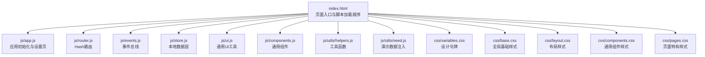
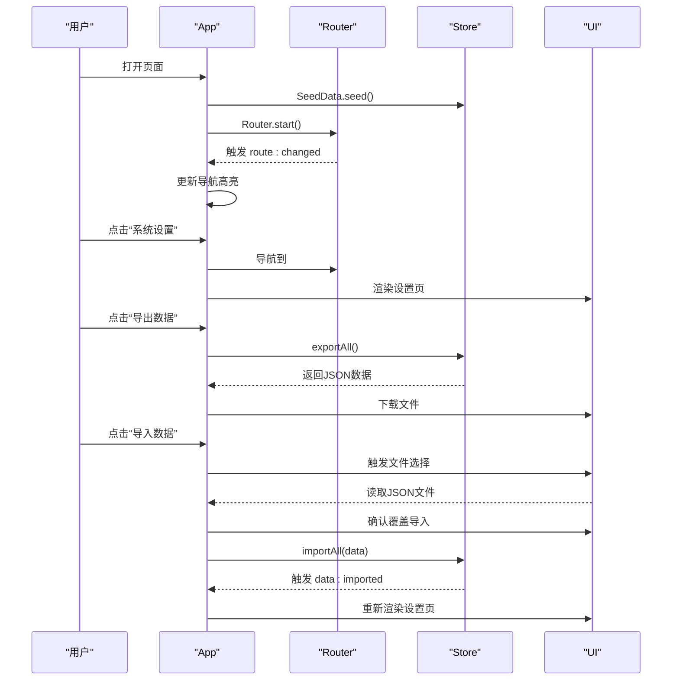
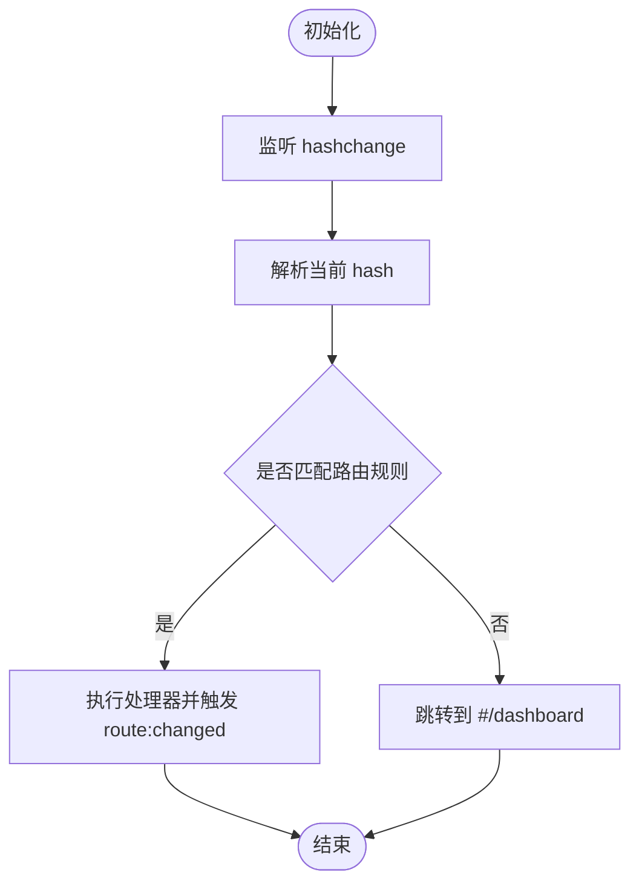
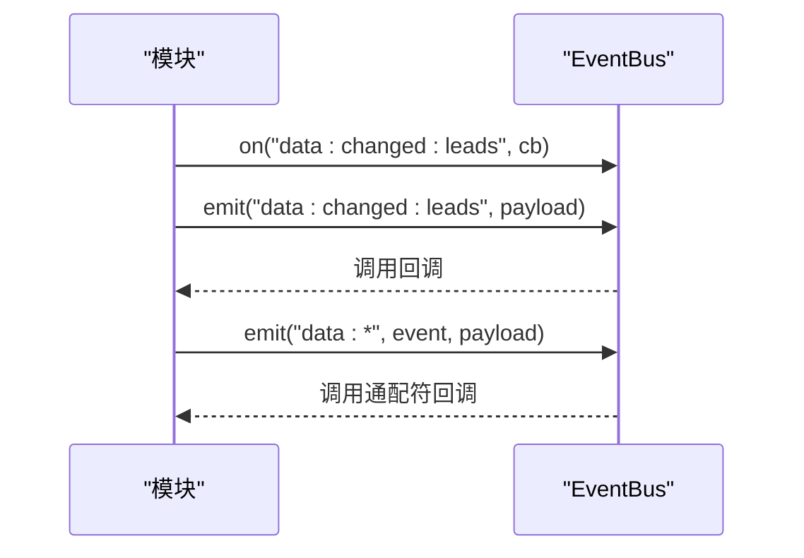
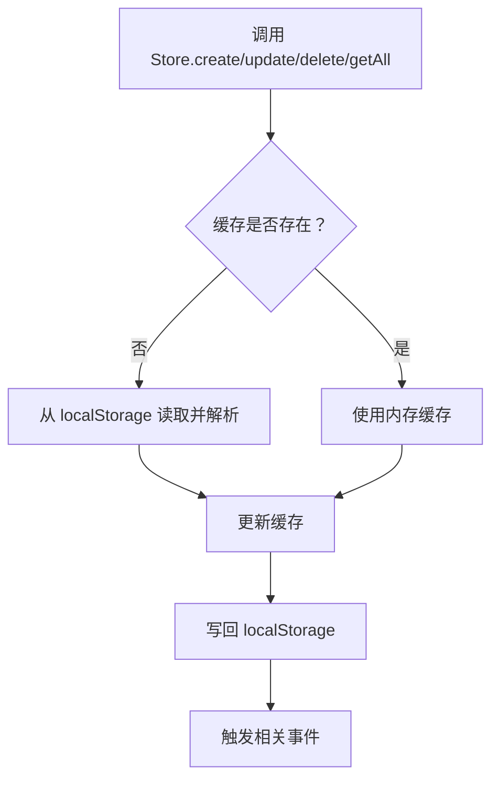
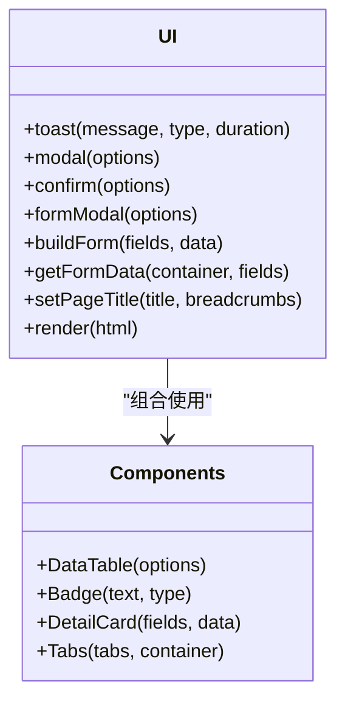
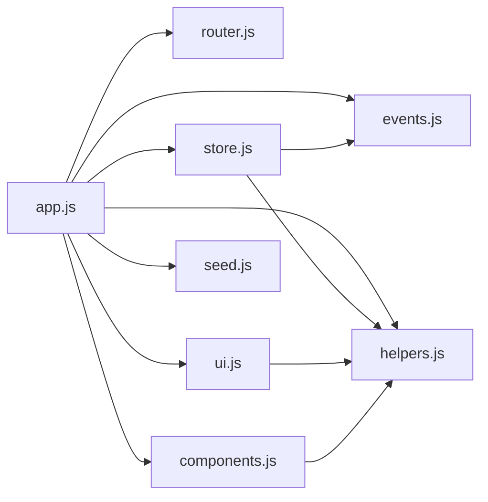

# 部署与维护

<cite>
**本文引用的文件**
- [index.html](file://index.html)
- [app.js](file://js/app.js)
- [store.js](file://js/store.js)
- [helpers.js](file://js/utils/helpers.js)
- [router.js](file://js/router.js)
- [events.js](file://js/events.js)
- [ui.js](file://js/ui.js)
- [components.js](file://js/components.js)
- [seed.js](file://js/utils/seed.js)
- [variables.css](file://css/variables.css)
- [base.css](file://css/base.css)
- [layout.css](file://css/layout.css)
- [components.css](file://css/components.css)
- [pages.css](file://css/pages.css)
</cite>

## 目录
1. [引言](#引言)
2. [项目结构](#项目结构)
3. [核心组件](#核心组件)
4. [架构总览](#架构总览)
5. [详细组件分析](#详细组件分析)
6. [依赖分析](#依赖分析)
7. [性能考虑](#性能考虑)
8. [故障排查指南](#故障排查指南)
9. [结论](#结论)
10. [附录](#附录)

## 引言
本文件面向CRM系统的部署与维护，围绕以下目标展开：部署配置与环境要求、静态文件托管与浏览器兼容性、数据备份与恢复（含localStorage导出/导入）、系统维护与更新流程、性能监控与优化、常见问题诊断与解决、安全与数据保护、版本升级与向后兼容说明。文档基于仓库中的前端实现进行分析，确保可操作性与可追溯性。

## 项目结构
该CRM系统采用纯前端单页应用（SPA）架构，资源组织清晰，分为HTML入口、样式与脚本模块两大部分：
- HTML入口负责页面骨架、导航、主内容区与脚本加载顺序
- 样式通过变量、基础、布局、组件、页面五个CSS文件分层组织
- JavaScript按职责拆分为应用入口、路由、事件总线、工具、UI组件、数据层、模块化业务逻辑与种子数据



图表来源
- [index.html:110-126](file://index.html#L110-L126)
- [app.js:1-41](file://js/app.js#L1-L41)
- [router.js:1-62](file://js/router.js#L1-L62)
- [events.js:1-36](file://js/events.js#L1-L36)
- [store.js:1-139](file://js/store.js#L1-L139)
- [ui.js:1-364](file://js/ui.js#L1-L364)
- [components.js:1-324](file://js/components.js#L1-L324)
- [helpers.js:1-113](file://js/utils/helpers.js#L1-L113)
- [seed.js:1-142](file://js/utils/seed.js#L1-L142)
- [variables.css:1-120](file://css/variables.css#L1-L120)
- [base.css:1-102](file://css/base.css#L1-L102)
- [layout.css:1-337](file://css/layout.css#L1-L337)
- [components.css:1-823](file://css/components.css#L1-L823)
- [pages.css:1-224](file://css/pages.css#L1-L224)

章节来源
- [index.html:1-129](file://index.html#L1-L129)
- [variables.css:1-120](file://css/variables.css#L1-L120)
- [base.css:1-102](file://css/base.css#L1-L102)
- [layout.css:1-337](file://css/layout.css#L1-L337)
- [components.css:1-823](file://css/components.css#L1-L823)
- [pages.css:1-224](file://css/pages.css#L1-L224)

## 核心组件
- 应用入口与生命周期
  - 初始化种子数据、注册设置路由、绑定导航/搜索/移动端侧边栏、启动路由、监听路由变更并更新导航高亮
- 路由系统
  - 基于Hash的轻量路由，支持命名参数、hashchange监听、编程式导航
- 事件总线
  - 支持订阅/退订/广播，含通配符事件派发
- 数据层（localStorage）
  - 提供集合读写、缓存、导出/导入、清空、计数、查询等能力
- UI与组件
  - 提供Toast、模态框、确认框、表单构建、数据表格、标签页等通用UI能力
- 工具函数
  - ID生成、日期/时间格式化、金额格式化、防抖、截断、HTML转义、颜色哈希、订单号生成等
- 种子数据
  - 首次运行检测为空则注入演示数据，包含产品、线索、客户、联系人、商机、订单、跟进记录

章节来源
- [app.js:1-316](file://js/app.js#L1-L316)
- [router.js:1-62](file://js/router.js#L1-L62)
- [events.js:1-36](file://js/events.js#L1-L36)
- [store.js:1-139](file://js/store.js#L1-L139)
- [ui.js:1-364](file://js/ui.js#L1-L364)
- [components.js:1-324](file://js/components.js#L1-L324)
- [helpers.js:1-113](file://js/utils/helpers.js#L1-L113)
- [seed.js:1-142](file://js/utils/seed.js#L1-L142)

## 架构总览
系统采用“HTML+CSS+JS”的纯前端SPA模式，无后端依赖。数据持久化依赖浏览器localStorage，具备完整的离线可用能力。页面通过Hash路由实现单页切换，配合事件总线解耦模块间通信。

```mermaid
graph TB
subgraph "前端应用"
R["Router<br/>Hash路由"] --> V["视图渲染<br/>UI/Components"]
E["EventBus<br/>事件总线"] --> V
S["Store<br/>localStorage数据层"] --> V
U["UI<br/>通用UI工具"] --> V
C["Components<br/>通用组件"] --> V
H["Helpers<br/>工具函数"] --> V
A["App<br/>应用入口"] --> R
A --> E
A --> S
A --> U
A --> C
A --> H
A --> Seed["SeedData<br/>演示数据注入"]
end
subgraph "持久化"
LS["localStorage"]
end
S <- --> LS
```

图表来源
- [app.js:1-41](file://js/app.js#L1-L41)
- [router.js:1-62](file://js/router.js#L1-L62)
- [events.js:1-36](file://js/events.js#L1-L36)
- [store.js:1-139](file://js/store.js#L1-L139)
- [ui.js:1-364](file://js/ui.js#L1-L364)
- [components.js:1-324](file://js/components.js#L1-L324)
- [helpers.js:1-113](file://js/utils/helpers.js#L1-L113)
- [seed.js:1-142](file://js/utils/seed.js#L1-L142)

## 详细组件分析

### 应用入口与设置页
- 初始化流程
  - 注入种子数据（仅当Store为空时）
  - 初始化各模块（仪表盘、产品、线索、客户、联系人、商机、订单、跟进）
  - 注册设置路由，绑定导航、全局搜索、移动端侧边栏
  - 启动路由并监听route:changed事件更新导航高亮
- 设置页功能
  - 数据导出：导出所有集合为JSON文件
  - 数据导入：从JSON文件导入并覆盖现有数据（带二次确认）
  - 重置演示数据：清空数据并重新注入
  - 清空所有数据：删除所有集合（带二次确认）
  - 数据统计：展示各集合数量



图表来源
- [app.js:1-316](file://js/app.js#L1-L316)
- [store.js:98-116](file://js/store.js#L98-L116)
- [router.js:54-60](file://js/router.js#L54-L60)
- [ui.js:48-78](file://js/ui.js#L48-L78)

章节来源
- [app.js:1-316](file://js/app.js#L1-L316)
- [store.js:98-116](file://js/store.js#L98-L116)

### 路由系统
- 支持命名参数的正则匹配
- hashchange监听与初始解析
- 编程式导航与当前路由查询
- 未匹配时自动跳转至仪表盘



图表来源
- [router.js:15-36](file://js/router.js#L15-L36)
- [router.js:54-60](file://js/router.js#L54-L60)

章节来源
- [router.js:1-62](file://js/router.js#L1-L62)

### 事件总线
- 订阅/退订/广播
- 通配符事件（如 data:*）



图表来源
- [events.js:7-30](file://js/events.js#L7-L30)

章节来源
- [events.js:1-36](file://js/events.js#L1-L36)

### 数据层（localStorage）
- 集合缓存与持久化
- CRUD与批量导出/导入/清空
- 错误处理与用户提示



图表来源
- [store.js:8-30](file://js/store.js#L8-L30)
- [store.js:53-96](file://js/store.js#L53-L96)
- [store.js:98-116](file://js/store.js#L98-L116)

章节来源
- [store.js:1-139](file://js/store.js#L1-L139)

### UI与组件
- Toast通知、模态框、确认框、表单构建、数据表格、标签页等
- 表格组件支持搜索、排序、分页、筛选、行点击与操作按钮



图表来源
- [ui.js:48-191](file://js/ui.js#L48-L191)
- [components.js:6-271](file://js/components.js#L6-L271)

章节来源
- [ui.js:1-364](file://js/ui.js#L1-L364)
- [components.js:1-324](file://js/components.js#L1-L324)

### 工具函数
- ID生成、日期/时间格式化、金额格式化、防抖、截断、HTML转义、颜色哈希、订单号生成、今天/当前时间戳

章节来源
- [helpers.js:1-113](file://js/utils/helpers.js#L1-L113)

### 种子数据
- 首次运行检测为空则注入演示数据，包含产品、线索、客户、联系人、商机、订单、跟进记录，并建立相互关联

章节来源
- [seed.js:6-142](file://js/utils/seed.js#L6-L142)

## 依赖分析
- 模块耦合
  - App依赖Router、EventBus、Store、UI、Components、Helpers、SeedData
  - Store依赖Helpers（ID/时间）、EventBus（事件派发）
  - UI/Components依赖Helpers（转义/格式化）
  - Router/EventBus相对独立，作为基础设施被上层模块依赖
- 外部依赖
  - 浏览器localStorage（持久化）
  - 浏览器History API（Hash路由）
  - 无第三方运行时依赖



图表来源
- [app.js:1-41](file://js/app.js#L1-L41)
- [store.js:1-139](file://js/store.js#L1-L139)
- [ui.js:1-364](file://js/ui.js#L1-L364)
- [components.js:1-324](file://js/components.js#L1-L324)
- [helpers.js:1-113](file://js/utils/helpers.js#L1-L113)
- [seed.js:1-142](file://js/utils/seed.js#L1-L142)

章节来源
- [app.js:1-41](file://js/app.js#L1-L41)
- [store.js:1-139](file://js/store.js#L1-L139)
- [ui.js:1-364](file://js/ui.js#L1-L364)
- [components.js:1-324](file://js/components.js#L1-L324)
- [helpers.js:1-113](file://js/utils/helpers.js#L1-L113)
- [seed.js:1-142](file://js/utils/seed.js#L1-L142)

## 性能考虑
- 渲染与交互
  - 使用防抖减少高频输入（如全局搜索、表格搜索）的计算压力
  - 表格组件内置分页与排序，避免一次性渲染大量DOM
- 存储与缓存
  - Store对集合进行内存缓存，减少localStorage频繁读写
  - 导出/导入采用一次性读取/写入，避免多次序列化/反序列化
- 样式与布局
  - 使用CSS变量统一主题，减少重复样式定义
  - 响应式布局在小屏设备上隐藏非必要文本，降低渲染负担
- 建议
  - 对超大数据集分页/虚拟滚动（当前表格组件已分页，可进一步优化）
  - 在导入前校验JSON结构，避免大规模写入失败导致的性能回退
  - 控制事件风暴，避免过多模块同时响应同一事件

章节来源
- [helpers.js:63-70](file://js/utils/helpers.js#L63-L70)
- [components.js:184-200](file://js/components.js#L184-L200)
- [store.js:8-30](file://js/store.js#L8-L30)

## 故障排查指南
- 无法加载或空白页面
  - 检查index.html中脚本加载顺序是否正确
  - 确认浏览器控制台无语法错误
- 数据丢失或异常
  - 检查localStorage容量与可用性
  - 使用“系统设置”中的“清空数据/重置演示数据”恢复
- 导入失败
  - 确认JSON格式有效且包含预期集合键
  - 导入会覆盖现有数据，导入前请先导出备份
- 路由不生效
  - 确认Router已启动且hashchange事件正常
  - 检查路由注册与命名参数是否匹配
- UI交互异常
  - 检查UI/Components依赖的Helpers是否正常
  - 确认CSS变量与布局样式未被覆盖

章节来源
- [index.html:110-126](file://index.html#L110-L126)
- [app.js:20-40](file://js/app.js#L20-L40)
- [store.js:23-30](file://js/store.js#L23-L30)
- [ui.js:48-78](file://js/ui.js#L48-L78)

## 结论
本CRM系统以纯前端实现，具备完整的数据持久化、路由与UI能力，适合在静态站点托管环境中部署。通过“系统设置”提供的导出/导入/重置/清空功能，可满足日常备份与恢复需求。建议在生产部署中结合CDN与HTTPS，完善监控与日志，持续关注localStorage容量与浏览器兼容性。

## 附录

### 部署与环境要求
- 静态文件托管
  - 将项目根目录下的所有文件（HTML/CSS/JS/Assets）部署至静态Web服务器或CDN
  - 确保index.html可直接访问，脚本与样式路径正确
- 浏览器兼容性
  - 使用现代浏览器（Chrome/Firefox/Safari/Edge）可获得最佳体验
  - 依赖特性：ES5+、localStorage、Hash路由、CSS变量、Flexbox、Grid
  - 不支持IE11及以下版本

章节来源
- [index.html:110-126](file://index.html#L110-L126)
- [variables.css:5-119](file://css/variables.css#L5-L119)
- [layout.css:291-337](file://css/layout.css#L291-L337)

### 数据备份与恢复
- 备份
  - 在“系统设置”中点击“导出数据”，下载JSON文件
- 恢复
  - 在“系统设置”中点击“导入数据”，选择之前导出的JSON文件
  - 导入会覆盖现有数据，导入前请确认风险
- 重置
  - “重置演示数据”会清空所有数据并重新注入演示数据
- 清空
  - “清空所有数据”删除所有集合，不可逆

章节来源
- [app.js:172-311](file://js/app.js#L172-L311)
- [store.js:98-132](file://js/store.js#L98-L132)

### 维护流程与更新机制
- 日常维护
  - 定期导出数据，核对备份完整性
  - 监控localStorage容量，避免超出限制导致保存失败
- 版本更新
  - 替换对应文件后，用户无需登录即可使用新版
  - 若涉及数据结构变更，需提供迁移脚本或引导用户重新注入演示数据

章节来源
- [store.js:23-30](file://js/store.js#L23-L30)
- [seed.js:10-142](file://js/utils/seed.js#L10-L142)

### 性能监控与优化建议
- 监控点
  - localStorage使用率与可用性
  - 页面渲染耗时与交互延迟
  - 导入/导出耗时与错误率
- 优化建议
  - 对超大数据集采用分页/虚拟滚动
  - 导入前进行结构校验与增量合并
  - 减少不必要的事件广播

章节来源
- [components.js:184-200](file://js/components.js#L184-L200)
- [store.js:23-30](file://js/store.js#L23-L30)

### 安全考虑与数据保护
- 客户端数据保护
  - 数据存储于localStorage，易受XSS与CSRF影响
  - 建议启用HTTPS、严格的Content-Security-Policy
  - 对用户输入进行HTML转义与长度/类型校验（已由Helpers与UI提供）
- 备份与传输
  - 导出文件为纯文本JSON，建议在安全网络中传输
  - 导入前进行格式校验，避免恶意数据

章节来源
- [helpers.js:78-84](file://js/utils/helpers.js#L78-L84)
- [ui.js:276-316](file://js/ui.js#L276-L316)

### 版本升级指南与向后兼容
- 升级步骤
  - 备份当前数据（导出JSON）
  - 替换新版本文件
  - 验证功能与路由
- 向后兼容
  - 当前实现未包含版本字段，升级后若数据结构变更，建议提供迁移脚本或引导用户“重置演示数据”

章节来源
- [app.js:172-311](file://js/app.js#L172-L311)
- [seed.js:10-142](file://js/utils/seed.js#L10-L142)