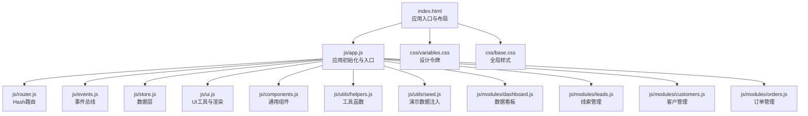
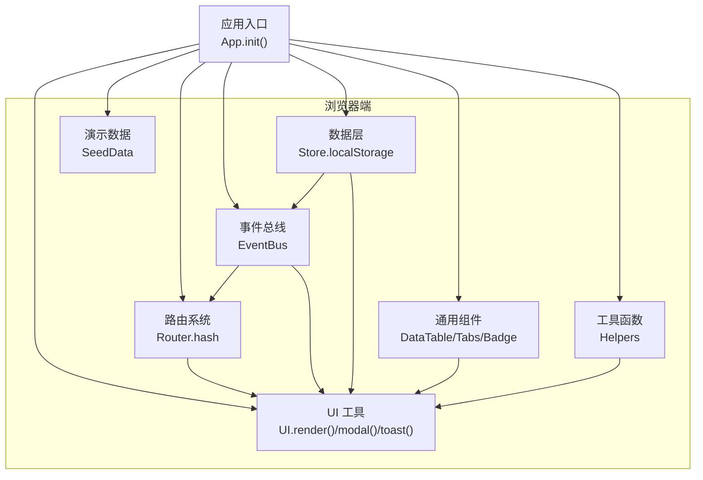
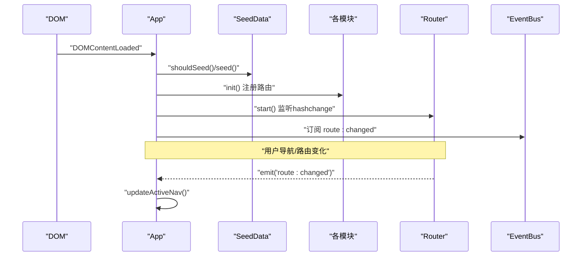
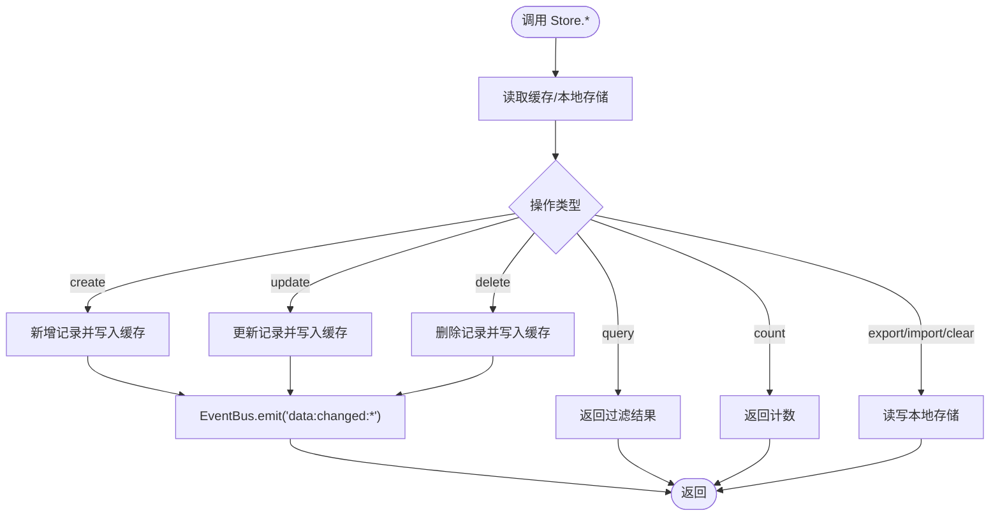
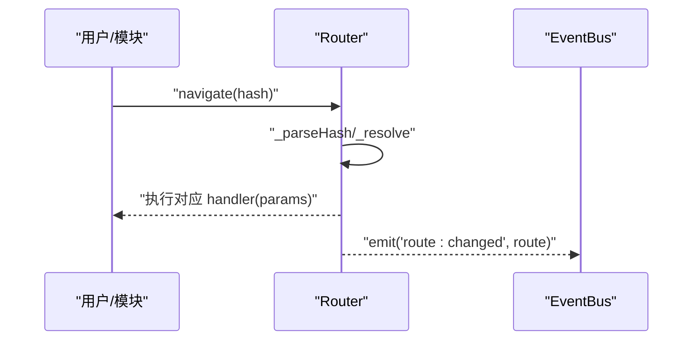
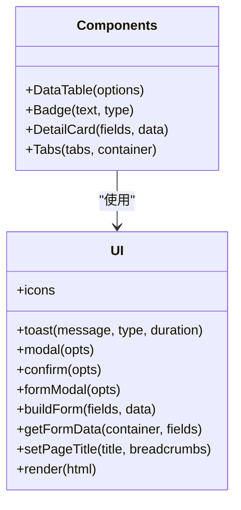
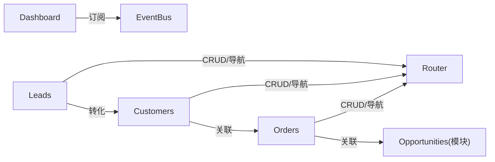
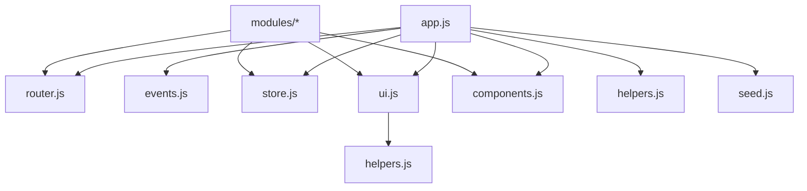
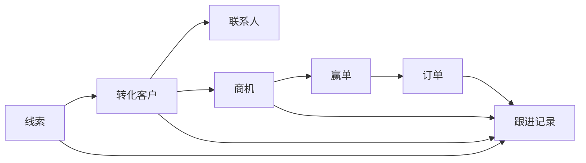

# 项目概述

<cite>
**本文档引用的文件**
- [index.html](file://index.html)
- [app.js](file://js/app.js)
- [store.js](file://js/store.js)
- [router.js](file://js/router.js)
- [events.js](file://js/events.js)
- [helpers.js](file://js/utils/helpers.js)
- [seed.js](file://js/utils/seed.js)
- [components.js](file://js/components.js)
- [ui.js](file://js/ui.js)
- [dashboard.js](file://js/modules/dashboard.js)
- [leads.js](file://js/modules/leads.js)
- [customers.js](file://js/modules/customers.js)
- [orders.js](file://js/modules/orders.js)
- [base.css](file://css/base.css)
- [variables.css](file://css/variables.css)
</cite>

## 目录
1. [引言](#引言)
2. [项目结构](#项目结构)
3. [核心组件](#核心组件)
4. [架构总览](#架构总览)
5. [详细组件分析](#详细组件分析)
6. [依赖分析](#依赖分析)
7. [性能考虑](#性能考虑)
8. [故障排除指南](#故障排除指南)
9. [结论](#结论)
10. [附录](#附录)

## 引言
本项目是一个纯前端单页应用（SPA）型 CRM 客户关系管理系统，专注于销售管理全链路：从线索获取、客户转化、商机推进，到订单完成与后续跟进。系统采用“零后端”架构，所有数据持久化于浏览器本地存储（localStorage），无需服务器即可运行，适合个人使用、演示部署或离线场景。

系统通过模块化设计与事件驱动架构实现高内聚低耦合，配合可复用的通用组件与 UI 工具，提供流畅的交互体验与清晰的数据流。同时，内置演示数据注入机制与数据导入导出能力，便于快速上手与数据迁移。

## 项目结构
项目采用“页面即模块”的组织方式，核心由一个入口 HTML 页面与一组 JS 模块组成，CSS 采用变量与分层样式文件，形成清晰的结构与可维护性。

图表来源
- [index.html:1-129](file://index.html#L1-L129)
- [app.js:1-316](file://js/app.js#L1-L316)
- [router.js:1-62](file://js/router.js#L1-L62)
- [events.js:1-36](file://js/events.js#L1-L36)
- [store.js:1-139](file://js/store.js#L1-L139)
- [ui.js:1-364](file://js/ui.js#L1-L364)
- [components.js:1-324](file://js/components.js#L1-L324)
- [helpers.js:1-113](file://js/utils/helpers.js#L1-L113)
- [seed.js:1-142](file://js/utils/seed.js#L1-L142)
- [dashboard.js:1-220](file://js/modules/dashboard.js#L1-L220)
- [leads.js:1-286](file://js/modules/leads.js#L1-L286)
- [customers.js:1-229](file://js/modules/customers.js#L1-L229)
- [orders.js:1-234](file://js/modules/orders.js#L1-L234)
- [variables.css:1-120](file://css/variables.css#L1-L120)
- [base.css:1-102](file://css/base.css#L1-L102)

章节来源
- [index.html:1-129](file://index.html#L1-L129)
- [app.js:1-316](file://js/app.js#L1-L316)

## 核心组件
- 应用入口与初始化：负责注入演示数据、初始化各模块、注册路由、绑定导航与搜索、启动路由与事件监听。
- 数据层（Store）：封装 localStorage 的读写、缓存、导出导入、清空等操作，并在变更时通过事件总线广播。
- 路由系统（Router）：基于 hash 的轻量路由，支持参数匹配与编程式导航。
- 事件总线（EventBus）：提供订阅/发布模式，支持通配符事件，解耦模块间通信。
- UI 工具（UI）：统一图标库、Toast、模态框、表单构建与校验、面包屑与内容渲染。
- 通用组件（Components）：数据表格、状态标签、详情卡片、标签页等，提供可复用的视图组件。
- 工具函数（Helpers）：ID 生成、日期/金额格式化、防抖、截断、HTML 转义、颜色哈希、订单号生成等。
- 演示数据（Seed）：首次运行时注入产品、线索、客户、联系人、商机、订单、跟进记录等演示数据。
- 模块化业务逻辑：Dashboard、Leads、Customers、Orders 等模块分别负责对应领域的 CRUD、筛选、排序、联动与视图渲染。

章节来源
- [app.js:1-316](file://js/app.js#L1-L316)
- [store.js:1-139](file://js/store.js#L1-L139)
- [router.js:1-62](file://js/router.js#L1-L62)
- [events.js:1-36](file://js/events.js#L1-L36)
- [ui.js:1-364](file://js/ui.js#L1-L364)
- [components.js:1-324](file://js/components.js#L1-L324)
- [helpers.js:1-113](file://js/utils/helpers.js#L1-L113)
- [seed.js:1-142](file://js/utils/seed.js#L1-L142)

## 架构总览
系统采用“纯前端 SPA + 本地存储”的架构，核心优势在于：
- 无需服务器：所有逻辑与数据均在浏览器端完成，可直接双击打开 index.html 使用。
- 事件驱动：通过 EventBus 实现模块间松耦合通信，数据变更自动触发相关视图更新。
- 模块化设计：每个业务域独立模块，职责清晰，易于扩展与维护。
- 可复用组件：通用组件与 UI 工具减少重复代码，提升一致性与开发效率。

图表来源
- [app.js:1-316](file://js/app.js#L1-L316)
- [router.js:1-62](file://js/router.js#L1-L62)
- [events.js:1-36](file://js/events.js#L1-L36)
- [store.js:1-139](file://js/store.js#L1-L139)
- [ui.js:1-364](file://js/ui.js#L1-L364)
- [components.js:1-324](file://js/components.js#L1-L324)
- [helpers.js:1-113](file://js/utils/helpers.js#L1-L113)
- [seed.js:1-142](file://js/utils/seed.js#L1-L142)

## 详细组件分析

### 应用入口与初始化（App）
- 注入演示数据：首次运行检测是否为空，若空则注入产品、线索、客户、联系人、商机、订单、跟进记录等演示数据。
- 初始化模块：依次调用各模块的 init 方法注册路由。
- 绑定导航与搜索：侧边栏导航点击跳转、移动端遮罩关闭、顶部全局搜索（跨模块聚合搜索）。
- 启动路由与事件：监听路由变化并更新导航高亮；订阅数据变更事件以刷新视图。

图表来源
- [app.js:1-316](file://js/app.js#L1-L316)
- [seed.js:1-142](file://js/utils/seed.js#L1-L142)
- [router.js:1-62](file://js/router.js#L1-L62)
- [events.js:1-36](file://js/events.js#L1-L36)

章节来源
- [app.js:1-316](file://js/app.js#L1-L316)

### 数据层（Store）
- 缓存策略：按集合读取 localStorage 并缓存，避免重复解析。
- 增删改查：提供 getAll/getById/query/count/create/update/delete。
- 导出导入：支持导出全部集合为 JSON，导入覆盖缓存与本地存储。
- 清空与校验：支持按集合或全量清空；提供 isEmpty 检测。
- 事件广播：每次数据变更通过 EventBus 发布事件，供订阅者响应。

图表来源
- [store.js:1-139](file://js/store.js#L1-L139)
- [events.js:1-36](file://js/events.js#L1-L36)

章节来源
- [store.js:1-139](file://js/store.js#L1-L139)

### 路由系统（Router）
- 支持静态路由与带参数的动态路由（如 :id）。
- 提供 navigate 与 current 方法，支持 hash 变更监听与初始解析。
- 匹配失败时自动跳转至默认页。

图表来源
- [router.js:1-62](file://js/router.js#L1-L62)
- [events.js:1-36](file://js/events.js#L1-L36)

章节来源
- [router.js:1-62](file://js/router.js#L1-L62)

### 事件总线（EventBus）
- on/off/emit：支持命名事件与通配符事件（如 data:changed:*）。
- 用于路由变化、数据变更、导入/清空等跨模块通知。

章节来源
- [events.js:1-36](file://js/events.js#L1-L36)

### 通用组件与 UI 工具
- DataTable：支持搜索、筛选、排序、分页、行点击、操作按钮、动态刷新。
- Badge/DetailCard/Tabs：提供状态展示、详情卡片与标签页切换。
- UI：统一图标库、Toast、模态框、表单构建与校验、面包屑与内容渲染。

图表来源
- [components.js:1-324](file://js/components.js#L1-L324)
- [ui.js:1-364](file://js/ui.js#L1-L364)

章节来源
- [components.js:1-324](file://js/components.js#L1-L324)
- [ui.js:1-364](file://js/ui.js#L1-L364)

### 演示数据注入（SeedData）
- 首次运行检测 Store.isEmpty()，若为空则批量注入产品、线索、客户、联系人、商机、订单、跟进记录。
- 自动将部分线索转化为客户，并建立联系人与商机/订单的关联。

章节来源
- [seed.js:1-142](file://js/utils/seed.js#L1-L142)

### 模块化业务逻辑
- Dashboard：统计卡片、销售漏斗、线索来源分布、待办提醒、最近活动。
- Leads：线索列表、详情、筛选、转化客户、删除、表单。
- Customers：客户列表、详情、联系人/商机/订单子视图、状态管理、删除、表单。
- Orders：订单列表、详情、子列表、状态管理、删除、表单（含订单号生成）。

图表来源
- [dashboard.js:1-220](file://js/modules/dashboard.js#L1-L220)
- [leads.js:1-286](file://js/modules/leads.js#L1-L286)
- [customers.js:1-229](file://js/modules/customers.js#L1-L229)
- [orders.js:1-234](file://js/modules/orders.js#L1-L234)
- [router.js:1-62](file://js/router.js#L1-L62)
- [events.js:1-36](file://js/events.js#L1-L36)

章节来源
- [dashboard.js:1-220](file://js/modules/dashboard.js#L1-L220)
- [leads.js:1-286](file://js/modules/leads.js#L1-L286)
- [customers.js:1-229](file://js/modules/customers.js#L1-L229)
- [orders.js:1-234](file://js/modules/orders.js#L1-L234)

## 依赖分析
- 模块耦合度：模块间通过 Router 与 EventBus 解耦，Store 作为共享数据源，降低直接依赖。
- 外部依赖：仅依赖浏览器原生 API（localStorage、fetch、FileReader 等），无第三方库。
- 潜在风险：localStorage 存储上限与性能限制；大量数据时建议分页与懒加载。

图表来源
- [app.js:1-316](file://js/app.js#L1-L316)
- [router.js:1-62](file://js/router.js#L1-L62)
- [events.js:1-36](file://js/events.js#L1-L36)
- [store.js:1-139](file://js/store.js#L1-L139)
- [ui.js:1-364](file://js/ui.js#L1-L364)
- [components.js:1-324](file://js/components.js#L1-L324)
- [helpers.js:1-113](file://js/utils/helpers.js#L1-L113)
- [seed.js:1-142](file://js/utils/seed.js#L1-L142)

章节来源
- [app.js:1-316](file://js/app.js#L1-L316)

## 性能考虑
- 渲染优化：使用防抖（debounce）处理搜索输入，减少频繁渲染；组件内部局部刷新（如 DataTable.refresh）。
- 存储优化：Store 对集合进行内存缓存，避免重复解析 localStorage；批量导入/清空时一次性写入。
- 视图优化：分页组件按需渲染，减少 DOM 节点数量；Toast/模态框按需创建与销毁。
- 数据量控制：建议在生产环境中限制单页数据量与复杂计算，必要时引入虚拟滚动或服务端代理（本项目为纯前端，不适用）。

## 故障排除指南
- 无法看到演示数据
  - 检查 SeedData.shouldSeed() 与 Store.isEmpty() 是否正确判断；确保 localStorage 可用。
  - 参考路径：[seed.js:6-8](file://js/utils/seed.js#L6-L8)，[store.js:135-137](file://js/store.js#L135-L137)
- 路由跳转无效或页面不刷新
  - 确认 Router.register 与 Router.navigate 使用正确；检查 EventBus.on('route:changed') 是否触发。
  - 参考路径：[router.js:8-36](file://js/router.js#L8-L36)，[app.js:36-38](file://js/app.js#L36-L38)
- 数据变更后视图未更新
  - 确认 Store.* 操作后是否触发 EventBus.emit；订阅方是否正确处理通配符事件。
  - 参考路径：[store.js:65-95](file://js/store.js#L65-L95)，[events.js:18-30](file://js/events.js#L18-L30)
- 搜索无结果或结果异常
  - 检查全局搜索的字段映射与防抖配置；确认结果容器的挂载与移除逻辑。
  - 参考路径：[app.js:63-160](file://js/app.js#L63-L160)
- 导入/导出失败
  - 导出：确认 Store.exportAll() 与 Blob/FileReader 正常；导入：确认 JSON 格式与 UI.confirm 流程。
  - 参考路径：[store.js:98-116](file://js/store.js#L98-L116)，[app.js:235-311](file://js/app.js#L235-L311)

章节来源
- [seed.js:1-142](file://js/utils/seed.js#L1-L142)
- [store.js:1-139](file://js/store.js#L1-L139)
- [router.js:1-62](file://js/router.js#L1-L62)
- [events.js:1-36](file://js/events.js#L1-L36)
- [app.js:1-316](file://js/app.js#L1-L316)

## 结论
本 CRM 系统以纯前端技术栈实现了销售管理的完整闭环，具备以下优势：
- 零服务器部署，开箱即用，适合个人与小型团队。
- 模块化与事件驱动架构，便于扩展与维护。
- 本地存储方案简单可靠，结合导入导出满足数据迁移需求。
- 通用组件与 UI 工具提升了开发效率与用户体验。

对于初学者，建议先从 Dashboard 与 Demo 数据入手，熟悉线索-客户-商机-订单的流转；对于有经验的开发者，可在现有模块基础上扩展更多业务域或引入服务端代理以支持更大规模数据。

## 附录

### 单页应用（SPA）概念简述
- 传统多页应用（MPA）：每次请求都会向服务器发起新页面请求，页面切换较慢。
- 单页应用（SPA）：页面只加载一次，通过前端路由与异步数据更新实现“无刷新”切换，交互更流畅。
- 本项目采用 Hash 路由（#开头），无需服务器配置即可运行。

### 销售管理全链路场景示意

[本图为概念示意，无需图表来源]